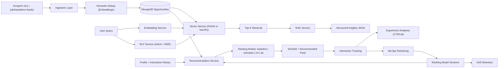

# VidyaVerse - AI Opportunity Intelligence Platform

## Problem
Students discover internships, research roles, scholarships, and hackathons across fragmented portals. Most systems rely on keyword filtering, weak personalization, and manual shortlisting, which leads to low relevance and poor application conversion.

## Latest Build Update (April 24, 2026)
- Infrastructure baseline aligned to MongoDB + Redis (local and production compose files no longer imply Postgres).
- Canonical Slim config added (`.slim.yaml`) and root `Makefile` workflows added (`make up`, `make dev`, `make doctor`).
- Session-cookie auth hardening shipped (HttpOnly cookie issuance on login/signup/OAuth, cookie-aware auth dependency, explicit logout endpoint).
- Ranking feature store widened with geo-fit + user-sequence dynamics to support stronger learned-ranker training.
- Dataset versioning script added: `backend/scripts/version_datasets.py` (anonymized user IDs + manifest checksums).
- Live-backend Playwright smoke test scaffold added (`frontend/e2e/live-backend-smoke.spec.ts`) for non-mocked staging verification.
- Complete localStorage token persistence removal: bearer tokens are no longer stored in browser localStorage.
- Slack + PagerDuty alert channel integrations added, with automatic incident creation and MLOps incident APIs.
- Offline/online parity gates added to activation policy (minimum real-traffic thresholds + regression checks).
- Integrated staging Playwright flow added for register/login/protected-page verification without mocked routes.
- Weekly incident-learning scorecard automation added via `backend/scripts/publish_weekly_mlops_scorecard.py` and CI workflow.
- CSRF protection middleware added for cookie-authenticated unsafe requests (origin/referer enforcement + trusted-origin controls).
- Browser security headers + nonce-based strict `script-src` CSP (no `unsafe-inline`/`unsafe-eval`) with enforced Trusted Types added (frontend + backend responses).
- Staging integrated E2E expanded with role/failure-path coverage (`frontend/e2e/staging-role-and-failure.spec.ts`).
- Ops secret-readiness workflow added to enforce staging/alert-channel ownership (`.github/workflows/ops-secrets-readiness.yml`).

## What Is Implemented (Current State)
### AI/ML and Data Components
- Modular embedding service with `sentence-transformers` primary path and OpenAI embedding fallback support.
- NLP service for:
  - intent classification (`internships`, `research`, `scholarships`, `hackathons`)
  - NER extraction (`deadlines`, `locations`, `companies`, `eligibility`)
- Vector retrieval service with FAISS acceleration when available and NumPy cosine fallback.
- Persistent vector index adapter (`mongo` provider) with in-memory fallback (`memory`) and text-hash invalidation.
- RAG service (`query -> retrieval -> structured insight generation`) exposed via `POST /api/v1/opportunities/ask-ai`.
- Recommendation stack with ranking modes: `baseline`, `semantic`, `ml`, `ab` (default online inference mode: `ml` with automatic request-level fallback on model failure).
- Interaction logging + experiment analytics endpoints (`CTR`, `lift`, experiment reports) with explicit `real` vs `simulated` traffic typing.
- Experiment-science diagnostics: SRM checks (chi-square allocation test), per-variant power/MDE diagnostics, minimum sample-size gates, and explicit `insufficient_power` labeling before declaring lift.
- Evaluation endpoints for ranking quality (`Precision@K`, `Recall@K`, `nDCG@K`, `MRR`) and LLM response quality with token/phrase PRF, rubric score, citation grounding, and judge-agreement diagnostics.
- Semantic deduplication during scraper upserts using embedding similarity thresholds.
- MLOps endpoints/services for retraining and drift checks.
- NLP model lifecycle endpoints for training, evaluation, model listing, and activation (`/api/v1/mlops/nlp/*`) with centroid-vs-linear-head macro-F1 uplift reporting and dedicated NER eval-set support.
- Expanded learned-ranker feature layer with geo-fit, source trust bucketing, freshness decay, deadline urgency, and user sequence dynamics (`recent_interactions_*`, `sequence_ctr_30d`, `last_interaction_hours`).

### Platform and Data Pipeline
- Multi-source ingestion: Ivy RSS + Indian opportunity sources.
- Resilient scraper runtime status + source-level run reports.
- Automatic updates via scheduler (default every 30 minutes).
- FastAPI backend + Next.js frontend with proxy routing.
- Versioned dataset snapshots with checksums + anonymized user IDs for reproducible ML datasets:
  - `python backend/scripts/version_datasets.py --name weekly --lookback-days 180`
  - output: `backend/benchmarks/datasets/<version>/manifest.json`

## Production Engineering Credibility
### Background Jobs (Retries + Dead-Letter Queue)
- Scraper + MLOps scheduled work is enqueued into a Mongo-backed job queue with retries and DLQ (`background_jobs` collection).
- Admin endpoints:
  - `POST /api/v1/opportunities/trigger-scraper` (enqueues)
  - `GET /api/v1/jobs/recent`
  - `GET /api/v1/jobs/dead-letter`

### Caching (Query Embeddings + Top-K Results)
- Redis-backed caching for query embeddings and semantic retrieval results.
- Key toggles: `CACHE_EMBEDDINGS_ENABLED`, `CACHE_SEARCH_ENABLED`.

### Observability (p95 Latency, Error Rates, Scraper Success, Freshness SLA)
- Prometheus endpoint: `GET /metrics` (requires `metrics:read` scope by default).
- Key signals:
  - `http_request_duration_seconds` (use for p95)
  - `http_responses_total` (error rates)
  - `scraper_runs_total` + `scraper_source_runs_total` (scraper success)
  - `opportunity_freshness_seconds` + `opportunity_freshness_sla_breached` (freshness SLA)
  - `ranking_request_latency_ms` + `ranking_requests_total` (ranking request p95 + failure rate by variant)
  - `opportunity_interaction_events_total` (CTR/apply-rate by experiment variant)
- Ops assets:
  - Grafana dashboard JSON: `ops/grafana/vidyaverse-production-overview.json`
  - Prometheus alert rules: `ops/alerts/prometheus-rules.yml`
  - Alertmanager routing template: `ops/alerts/alertmanager-routes.yml`
  - Incident runbook: `docs/runbooks/incident-response.md`
  - Security hardening runbook: `docs/runbooks/security-hardening-final-mile.md`

### Security
- Auth scopes embedded in JWTs (admin tokens include `admin`, `metrics:read`, `jobs:*`, `scraper:trigger`).
- Redis-backed per-IP rate limits with stricter limits for `/api/v1/auth/*`.
- Auth abuse lock policy for password + OTP verification with configurable thresholds (`AUTH_ABUSE_*`).
- Structured auth security audit events (`auth_audit_events`) + active lock-state tracking (`auth_abuse_states`).
- Production secret enforcement: refuses to boot in `ENVIRONMENT=production` if `SECRET_KEY` is left as the dev default.
- Session-cookie support added (HttpOnly, SameSite-configurable, secure in production) with bearer fallback for compatibility:
  - new endpoint: `POST /api/v1/auth/logout`
  - auth dependency now accepts bearer token **or** session cookie.
- Frontend auth no longer persists bearer tokens in `localStorage`; browser state is a non-sensitive session marker + expiry while auth trust is cookie/session based.
- CSRF middleware now blocks unsafe cookie-session requests when origin/referer is missing or untrusted.
- Security headers now include CSP + Trusted Types directives and standard browser hardening headers.

## What Is Still Missing (High Impact Next)
- Sustained real-user traffic volume for statistically stable experiment reads across all three arms (`baseline`, `semantic`, `ml`).
- Live Slack/PagerDuty secret wiring and escalation policies in staging+production (code integrations are now implemented; environment credentials and routing policy ownership remain).
- Continuous post-incident learning loop operations (auto incident creation/timeline APIs and weekly scorecard automation are implemented; recurring review cadence and ownership SLAs must be enforced).
- Full multi-role staging E2E maturity with seeded employer/admin credentials across environments (current suite supports optional secret-gated checks and candidate/failure paths).

## Architecture Diagram


Portfolio publish artifacts live in:
- `docs/portfolio/architecture.md`
- `docs/portfolio/ablation_table.md`
- `docs/portfolio/screenshot_pack.md`
- `docs/portfolio/screenshots/`

## Dataset Size (Verified Snapshot)
Snapshot date: **April 16, 2026**

- Opportunities: **202**
- Applications: **16**
- Opportunity interactions: **15,961**
- Experiments: **2**
- Experiment assignments: **300**
- Ranking model versions: **3**
- Drift reports: **1**
- Profiles: **320**
- Users: **323**

Source distribution for opportunities:
- `freshersworld`: 60
- `internshala`: 58
- `indeed_india`: 32
- `unstop`: 30
- `ivy_rss`: 14
- `hack2skill`: 5

## Latency (Local API Benchmark)
Benchmark date: **April 16, 2026**
Server: FastAPI on `127.0.0.1:8000`, 50 requests per endpoint.

| Endpoint | p50 | p95 | avg | max |
|---|---:|---:|---:|---:|
| `GET /api/v1/opportunities/?limit=30` | 116.75 ms | 242.38 ms | 152.05 ms | 513.28 ms |
| `GET /api/v1/opportunities/scraper-status` | 0.81 ms | 1.26 ms | 1.01 ms | 7.36 ms |

## Metric Gains (Offline Retrieval Benchmark)
Benchmark artifact: `backend/benchmarks/results.json` (12 queries, K=5).
Labeling protocol: `docs/benchmarks/labeling-protocol.md`

| Metric | Baseline | Semantic | Gain |
|---|---:|---:|---:|
| Precision@5 | 0.066667 | 0.200000 | +200.00% |
| Recall@5 | 0.333333 | 1.000000 | +200.00% |
| nDCG@5 | 0.333333 | 1.000000 | +200.00% |
| MRR@5 | 0.333333 | 1.000000 | +200.00% |

Interpretation:
- The benchmark fixture now contains hard negatives where lexical overlap ties are common.
- Semantic ranking is measurably separated, and CI enforces both metric-regression and latency budgets.

## Model Lifecycle Results
Auto-publish command:
```bash
python backend/scripts/publish_model_metadata.py
```

End-to-end lifecycle command (retrain on current interactions, champion activation, drift snapshot, README + artifact publish):
```bash
python backend/scripts/run_model_lifecycle_pipeline.py
```

One-command reproducibility command (offline holdout benchmark + lifecycle + metadata publish):
```bash
./scripts/reproduce_results.sh
```

Portfolio/ATS ablation bundle publish:
```bash
python backend/scripts/publish_portfolio_bundle.py
```

Weekly MLOps incident-learning scorecard publish:
```bash
python backend/scripts/publish_weekly_mlops_scorecard.py --days 7
```

Dashboard screenshot pack capture (with Slim-hosted frontend):
```bash
./scripts/capture_dashboard_screenshots.sh
```

Reproducible DS notebook:
- `docs/notebooks/analytics_warehouse_story.ipynb`

Local security secret rotation utility:
```bash
python backend/scripts/rotate_local_secrets.py --env-file backend/.env
```

<!-- MODEL_VERSION_METADATA:START -->

Updated: **2026-04-18T07:04:42.628589**

Policy: `guarded` (auto_activate=False, min_auc_gain=0.0, min_positive_rate=0.005, max_weight_shift=0.35)
Schedule: retrain every `24h`, drift check every `6h`, drift-triggered retrain=`True`
Alerts: enabled=`True`, cooldown=`120m`

Active model: `69e1c43e` (ranking-weights-v2) rows=11530 auc_gain=0.020068 activation_reason=`auto_activate_disabled`

Recent model versions:

| id | created_at | active | rows | auc_default | auc_learned | auc_gain | positive_rate | activation_reason |
|---|---|---:|---:|---:|---:|---:|---:|---|
| `69e32cf4` | 2026-04-18T07:04:20.592000 | no | 11530 | 0.547235 | 0.565407 | 0.018172 | 0.159237 | weight_shift_above_threshold:1.400000>0.350000 |
| `69e1c43e` | 2026-04-17T05:25:18.324000 | yes | 11530 | 0.547235 | 0.567303 | 0.020068 | 0.159237 | auto_activate_disabled |
| `69e1c37a` | 2026-04-17T05:22:02.094000 | no | 11530 | 0.530699 | 0.543927 | 0.013229 | 0.159237 | auto_activate_disabled |
| `69e1c362` | 2026-04-17T05:21:38.033000 | no | 11530 | 0.530699 | 0.543927 | 0.013229 | 0.159237 | auto_activate_disabled |
| `69e1c2d3` | 2026-04-17T05:19:15.238000 | no | 11530 | 0.530699 | 0.543927 | 0.013229 | 0.159237 | auto_activate_disabled |
| `69e12a18` | 2026-04-16T18:27:36.837000 | no | 11530 | 0.530699 | 0.543927 | 0.013229 | 0.159237 | auto_activate_disabled |
| `69e121b1` | 2026-04-16T17:51:45.261000 | no | 11530 | 0.530699 | 0.543927 | 0.013229 | 0.159237 | auto_activate_disabled |
| `69e1213f` | 2026-04-16T17:49:51.023000 | no | 11530 | 0.530699 | 0.543927 | 0.013229 | 0.159237 | auto_activate_disabled |
| `69e11e3d` | 2026-04-16T17:37:01.303000 | no | 11530 | 0.530699 | 0.543927 | 0.013229 | 0.159237 | auto_activate_disabled |
| `69e10cf1` | 2026-04-16T16:23:13.598000 | no | 4480 | 0.523782 | 0.513580 | -0.010202 | 0.143080 | n/a |
| `69e10c4a` | 2026-04-16T16:20:26.935000 | no | 4480 | 0.523782 | 0.513580 | n/a | 0.143080 | n/a |
| `69e10c0e` | 2026-04-16T16:19:26.647000 | no | 0 | 0.000000 | 0.000000 | n/a | 0.000000 | n/a |

Latest drift report: id=`69e32d07` alert=`False` psi=0.030294 max_z=0.069408 notified_at=n/a

<!-- MODEL_VERSION_METADATA:END -->

## Simulated Traffic Benchmark (Persona-Based)
Transparency label: **Simulated traffic benchmark (persona-based)**  
Artifact: `backend/benchmarks/simulated/persona_traffic_report.json`

Run command (200-500 Indian personas):
```bash
cd backend
python3 scripts/simulate_persona_traffic.py \
  --personas 300 \
  --impressions-per-persona 24 \
  --lookback-days 14 \
  --seed 2026 \
  --email-prefix sim.india \
  --experiment-key ranking_mode_persona_sim \
  --real-pilot-experiment-key ranking_mode \
  --replace \
  --out ../backend/benchmarks/simulated/persona_traffic_report.json
```

Latest simulated run:
- Personas: **300**
- Generated interactions: **10,793**
- Funnel breakdown: `impression=7,050`, `view=2,018`, `click=1,195`, `save=366`, `apply=164`
- Variant mix: `baseline=5,181` events, `semantic=5,612` events

Simulated lift vs control (baseline -> semantic):
- Click-rate lift: **-6.13%** (`p=0.2306`)
- Apply-rate lift: **-31.27%** (`p=0.0155`)
- Save-rate lift: **-15.69%** (`p=0.0934`)

## Real Pilot Snapshot (Authentic Usage Data)
From live `ranking_mode` experiment (baseline vs ml), 14-day window:
- CTR lift (`ml` vs baseline): **+58.21%** (`p=4.4e-07`)
- Apply-rate lift (`ml` vs baseline): **+153.11%** (`p=0.0015`)
- Save-rate lift (`ml` vs baseline): **+138.67%** (`p=2e-08`)

## A/B Lift Endpoints
- `GET /api/v1/opportunities/experiments/ctr`
- `GET /api/v1/opportunities/experiments/lift`
- `GET /api/v1/experiments/{experiment_key}/report`
- `GET /api/v1/experiments/reports/side-by-side` (real vs simulated bundles)

## Same-Day Real Pilot (10-20 Testers)
1. Keep experiment `ranking_mode` active.
2. Share web app URL to 10-20 testers for a 2-3 hour session.
3. Ensure frontend logs impression/click/save/apply events to `POST /api/v1/opportunities/interactions`.
4. Pull experiment reports and publish both:
   - simulated benchmark (`ranking_mode_persona_sim`)
   - real pilot (`ranking_mode`)

## API Surface (Core AI/ML Endpoints)
- `GET /api/v1/opportunities/recommended/me?ranking_mode=baseline|semantic|ml|ab&query=...`
- `GET /api/v1/opportunities/shortlist/me?ranking_mode=baseline|semantic|ml|ab&query=...`
- `POST /api/v1/opportunities/ask-ai`
- `GET /api/v1/opportunities/ask-ai/schema`
- `POST /api/v1/opportunities/interactions`
- `POST /api/v1/opportunities/evaluate-ranking`
- `POST /api/v1/opportunities/evaluate-llm` (token/phrase PRF, citation-grounding, rubric score, optional judge agreement)
- `GET /api/v1/opportunities/experiments/ctr`
- `GET /api/v1/opportunities/experiments/lift`
- `POST /api/v1/employer/opportunities` / `PATCH /api/v1/employer/opportunities/{id}` / `POST /api/v1/employer/opportunities/{id}/lifecycle`
- `GET /api/v1/employer/applications` / `PATCH /api/v1/employer/applications/{id}/pipeline`
- `GET /api/v1/employer/audit-logs`
- `POST /api/v1/analytics/warehouse/rebuild` / `GET /api/v1/analytics/warehouse/*` / `GET /api/v1/analytics/feature-store/rows`
- `GET /api/v1/rag-governance/templates` / `POST /api/v1/rag-governance/templates` / offline+online eval + activation endpoints
- `POST /api/v1/auth/logout` / `GET /api/v1/auth/audit-events` / `GET /api/v1/auth/abuse-locks` (admin)
- `POST /api/v1/mlops/retrain`
- `GET /api/v1/mlops/models`
- `POST /api/v1/mlops/nlp/train`
- `POST /api/v1/mlops/nlp/evaluate`
- `GET /api/v1/mlops/nlp/models`
- `POST /api/v1/mlops/nlp/models/{model_id}/activate`
- `GET /api/v1/mlops/drift`
- `GET /api/v1/mlops/lifecycle`
- `GET /api/v1/mlops/incidents` / `GET /api/v1/mlops/incidents/{incident_id}` / `PATCH /api/v1/mlops/incidents/{incident_id}` / `POST /api/v1/mlops/incidents/{incident_id}/timeline`
- `GET /api/v1/admin/openapi.json` (admin-authenticated OpenAPI export, production-safe)
- `GET /api/v1/admin/docs` (admin-authenticated Swagger UI, production-safe)

## Local Run
### Dependencies (Mongo + Redis)
```bash
make up
# or: docker compose up -d mongo redis
```

### Backend
```bash
cd backend
python3 -m venv venv
source venv/bin/activate
pip install -r requirements.txt
playwright install chromium
uvicorn app.main:app --reload --host 0.0.0.0 --port 8000
```

Production env templates:
```bash
backend/.env.example
backend/.env.production.example
```

Auth session cookie controls:
- `AUTH_SESSION_COOKIE_ENABLED`
- `AUTH_SESSION_COOKIE_NAME`
- `AUTH_SESSION_COOKIE_SECURE` (set `true` in production)
- `AUTH_SESSION_COOKIE_SAMESITE`
- `AUTH_SESSION_COOKIE_MAX_AGE_SECONDS`

CSRF + browser security controls:
- `CSRF_PROTECTION_ENABLED`
- `CSRF_ENFORCE_ON_AUTH_COOKIE`
- `CSRF_TRUSTED_ORIGINS`
- `SECURITY_HEADERS_ENABLED`
- `SECURITY_CSP_ENABLED`
- `SECURITY_CSP_REPORT_ONLY`
- optional CSP override: `SECURITY_CSP_VALUE`

MLOps alert channels + incident loop controls:
- `MLOPS_ALERT_SLACK_WEBHOOK_URL`
- `MLOPS_ALERT_PAGERDUTY_ROUTING_KEY`
- `MLOPS_ALERT_PAGERDUTY_SEVERITY`
- `MLOPS_INCIDENT_AUTO_CREATE`
- `MLOPS_INCIDENT_REVIEW_DUE_HOURS`
- `MLOPS_INCIDENT_BREACH_SLA_HOURS`
- `MLOPS_ENFORCE_LIVE_ALERT_CHANNELS_IN_PRODUCTION`
- `MLOPS_ENFORCE_OWNER_IN_PRODUCTION`

Offline/online parity controls for auto-activation:
- `MLOPS_PARITY_ENABLED`
- `MLOPS_PARITY_MIN_REAL_IMPRESSIONS_PER_MODE`
- `MLOPS_PARITY_MIN_REAL_REQUESTS_PER_MODE`
- `MLOPS_PARITY_MAX_CTR_REGRESSION`
- `MLOPS_PARITY_MAX_APPLY_RATE_REGRESSION`
- `MLOPS_PARITY_MIN_OFFLINE_AUC_GAIN_FOR_ONLINE_GATES`

OpenAI-compatible LLM routing (NVIDIA/OpenRouter/etc) is controlled by:
- `LLM_API_BASE_URL`
- `LLM_API_KEY`
- `LLM_MODEL`
- optional judge overrides: `LLM_JUDGE_API_BASE_URL`, `LLM_JUDGE_API_KEY`, `LLM_JUDGE_MODEL`

Embedding fallback routing:
- primary local model: `EMBEDDING_PROVIDER=sentence_transformers`
- fallback endpoint: `OPENAI_API_KEY` (+ optional `OPENAI_API_BASE_URL`)

RAG contract tests:
```bash
cd backend
venv/bin/python -m unittest discover -s tests -p 'test_*.py'
```

### Frontend
```bash
cd frontend
npm install
npm run dev
```

Frontend E2E interaction coverage (Playwright):
```bash
cd frontend
npx playwright install chromium
npm run e2e
```

Integrated live-backend smoke checks (no route mocks):
```bash
cd frontend
PLAYWRIGHT_LIVE_BACKEND=1 npm run e2e -- --grep "Live backend smoke"
```

Integrated staging auth + protected-page checks (no route mocks):
```bash
cd frontend
PLAYWRIGHT_STAGING_URL=https://your-staging-web-domain.com \
PLAYWRIGHT_INTEGRATED_AUTH=1 \
npm run e2e:staging
```

Optional deeper staging role-path coverage secrets:
- `PLAYWRIGHT_STAGING_ADMIN_BEARER`
- `PLAYWRIGHT_STAGING_EMPLOYER_EMAIL`
- `PLAYWRIGHT_STAGING_EMPLOYER_PASSWORD`

Ops secret bootstrap helper (GitHub secrets + vars):
```bash
STAGING_PLAYWRIGHT_BASE_URL=https://staging.example.com \
MLOPS_ALERT_SLACK_WEBHOOK_URL=https://hooks.slack.com/services/... \
MLOPS_ALERT_PAGERDUTY_ROUTING_KEY=... \
MLOPS_INCIDENT_DEFAULT_OWNER=oncall-ml@your-company.com \
./scripts/configure_ops_secrets.sh owner/repo
```

Real-traffic rollout readiness report:
```bash
python backend/scripts/check_real_traffic_rollout_readiness.py --days 14
```

Unified PR quality gate (backend tests + frontend lint/build + Playwright smoke):
```bash
.github/workflows/pr-quality-gate.yml
```

### Bootstrap Ranking Data + Model Version (Staging/Prod Warmup)
```bash
cd backend
python scripts/bootstrap_ranking_pipeline.py --clear-existing --run-retrain --auto-activate
```

### Slim Domains (Preferred Workflow)
```bash
make dev
# reads .slim.yaml via `slim up`
# https://web.test -> localhost:3000
# https://api.test -> localhost:8000

# Share a local preview publicly
slim share --port 3000 --subdomain demo --ttl 2h
```

Manual equivalent:
```bash
slim start web --port 3000
slim start api --port 8000
```

If you enable Google OAuth while using Slim-hosted local domains, register and set:
- `GOOGLE_OAUTH_REDIRECT_URI=https://api.test/api/v1/auth/oauth/google/callback`
- `FRONTEND_OAUTH_SUCCESS_URL=https://web.test/auth/callback`
- `FRONTEND_OAUTH_FAILURE_URL=https://web.test/login`

### Versioned Dataset Snapshots
```bash
python backend/scripts/version_datasets.py --name weekly --lookback-days 180
```

## Resume-Grade Positioning
Built an AI-powered opportunity intelligence platform with modular NLP/ML services (embeddings, intent+NER, vector retrieval, RAG), ranking experimentation (`baseline/semantic/ml/ab`), interaction analytics, and MLOps retraining/drift pipelines on a FastAPI + Next.js architecture.
