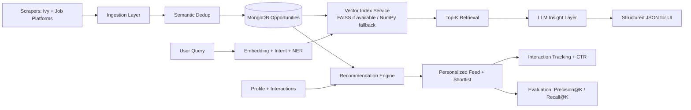

# VidyaVerse - AI Opportunity Intelligence Platform

## Problem
Students discover internships, scholarships, research roles, and hackathons across fragmented portals. Most feeds are keyword-filtered, hard to prioritize, and weakly personalized.

## Solution (AI System Overview)
VidyaVerse is a production-style FastAPI + Next.js system that combines scraping, semantic retrieval, ranking intelligence, and LLM-assisted shortlisting.

### Core Upgrades Implemented
- Semantic ranking with embeddings (`sentence-transformers` primary, OpenAI fallback).
- Intent classification (`internships`, `research`, `scholarships`, `hackathons`).
- NER extraction for deadlines, locations, companies, eligibility signals.
- RAG pipeline for “Ask AI” shortlisting and reasoning.
- Personalization weighting via profile + interaction history.
- A/B-ready ranking modes: `baseline`, `semantic`, `ab`.
- Interaction telemetry + CTR analytics by ranking mode.
- Evaluation endpoints for Precision@K, Recall@K, and LLM output quality.
- Semantic deduplication during scraper ingestion using embedding similarity.

## Architecture


## Backend Modules
- `backend/app/services/embedding_service.py`
  - Embedding provider abstraction with local sentence-transformers and OpenAI fallback.
- `backend/app/services/nlp_service.py`
  - Intent classification + NER extraction.
- `backend/app/services/vector_service.py`
  - Vector search with FAISS acceleration when installed; NumPy cosine fallback otherwise.
- `backend/app/services/rag_service.py`
  - Query retrieval + structured LLM insights.
- `backend/app/services/recommendation_service.py`
  - Baseline + semantic + behavior-weighted ranking and A/B mode.
- `backend/app/services/interaction_service.py`
  - Click/view/apply/impression tracking and CTR analytics.
- `backend/app/services/evaluation_service.py`
  - Ranking and response quality evaluation.

## API Additions
### Opportunities
- `GET /api/v1/opportunities/recommended/me?ranking_mode=baseline|semantic|ab&query=...`
- `GET /api/v1/opportunities/shortlist/me?ranking_mode=baseline|semantic|ab&query=...`
- `POST /api/v1/opportunities/ask-ai`
- `POST /api/v1/opportunities/interactions`
- `GET /api/v1/opportunities/experiments/ctr` (admin)
- `POST /api/v1/opportunities/evaluate-ranking`
- `POST /api/v1/opportunities/evaluate-llm`

## ML Techniques Used
- Sentence embeddings for semantic retrieval/ranking.
- Cosine similarity for query-opportunity relevance.
- Lightweight intent classification with embedding label matching.
- spaCy-driven NER + regex enrichment.
- Hybrid ranking:
  - Baseline profile-opportunity score.
  - Semantic relevance score.
  - Behavioral preference score from interactions.
- RAG orchestration: retrieve → reason → structured JSON output.

## Results & Evaluation
Use the built-in endpoints to measure ranking and response quality.

### Ranking Quality
`POST /api/v1/opportunities/evaluate-ranking`
- Returns `Precision@K` and `Recall@K` for both baseline and semantic ranking.

### LLM Output Quality
`POST /api/v1/opportunities/evaluate-llm`
- Returns keyword coverage and optional semantic similarity vs expected output.

## Running Locally
### 1. Backend
```bash
cd backend
python3 -m venv venv
source venv/bin/activate
pip install -r requirements.txt
playwright install chromium
uvicorn app.main:app --reload --host 0.0.0.0 --port 8000
```

Auto-update scheduler defaults to every 30 minutes. Configure in `backend/.env`:
```bash
SCRAPER_AUTORUN_ENABLED=true
SCRAPER_INTERVAL_MINUTES=30
SCRAPER_MAX_STALENESS_MINUTES=30
SCRAPER_ON_DEMAND_REFRESH_ENABLED=true
```

For daily updates instead:
```bash
SCRAPER_INTERVAL_MINUTES=1440
SCRAPER_MAX_STALENESS_MINUTES=1440
```

### 2. Frontend
```bash
cd frontend
npm install
npm run dev
```

### 3. Host Local Web Apps with Slim (Required Workflow)
Install Slim:
```bash
curl -sL https://slim.sh/install.sh | sh
```

Expose frontend with HTTPS local domain:
```bash
slim start web --port 3000
# https://web.test -> localhost:3000
```

Expose backend with local domain:
```bash
slim start api --port 8000
# https://api.test -> localhost:8000
```

Public sharing when needed:
```bash
slim share --port 3000 --subdomain demo
# https://demo.slim.show -> localhost:3000
```

## Resume-Grade Summary
Built a production-grade AI recommendation system using RAG, embeddings, and LLM-driven insights, with semantic ranking, interaction-based personalization, and evaluation instrumentation (Precision@K/Recall@K + response quality checks) over a continuously ingested multi-source opportunity pipeline.

## Future Improvements
- Persisted vector DB backend (ChromaDB or managed vector store) for multi-node scaling.
- Re-ranking with cross-encoders for higher precision at low K.
- Learned-to-rank from click/apply outcomes.
- Continuous offline benchmark set and automated regression gates.
- Feature-store style user embeddings for deeper personalization.
