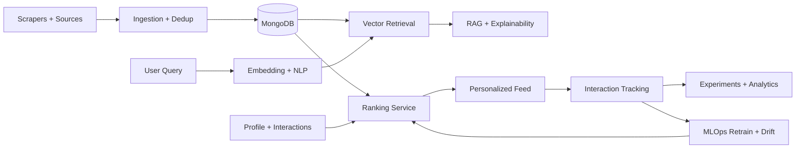

# VidyaVerse

AI-powered opportunity intelligence platform for internships, research, scholarships, and hackathons.

Last updated: **April 28, 2026**

## What This App Is
VidyaVerse is a full-stack data + AI/ML product that helps students discover high-fit opportunities faster, understand why each match is relevant, and track outcomes through experimentation and analytics.

It combines:
- multi-source ingestion
- semantic retrieval + RAG
- learned ranking
- experimentation pipelines
- production-grade security and ops controls

## Core Motive
Students currently search fragmented portals manually, leading to poor discoverability, weak relevance, and low application conversion. VidyaVerse turns that into a measurable intelligence workflow: collect -> rank -> explain -> act -> learn.

## Standout Factor
Most opportunity portals stop at listing and filtering. VidyaVerse is built as an end-to-end intelligence system:
- retrieval + ranking + explanation in one loop
- online/offline parity gates before model promotion
- experiment analytics tied to real user behavior
- production hardening (cookie auth, CSP/CSRF, abuse locks, audit events)
- hidden admin control plane with strict single-admin + TOTP

## What’s Shipped
### Product + UX
- Guest dashboard preview flow: unauthenticated users can open `/dashboard` as a demo surface.
- Signed-in users on `/dashboard` get their personalized live experience.
- Candidate + employer journey support.
- Ask AI panel with grounded opportunity responses.

### Data + AI/ML
- Multi-source scraper ingestion pipeline.
- Semantic deduplication during ingestion.
- Embeddings + vector retrieval (FAISS when available, NumPy fallback).
- NLP intent + NER support for opportunity understanding.
- Ranking modes: `baseline`, `semantic`, `ml`, `ab`.
- Learned ranker with retraining, drift detection, and activation policy controls.
- Offline benchmark and parity gate workflows.

### Full-Stack Platform
- FastAPI backend + Next.js frontend.
- MongoDB-first persistence + Redis caching/rate limiting.
- Background jobs with retries and dead-letter handling.
- Integrated staging E2E scaffolds and release gates.

### Security + Reliability
- Cookie-first auth with HttpOnly sessions; localStorage token persistence removed.
- CSRF enforcement + security headers + strict CSP/Trusted Types configuration.
- Auth abuse lockouts + audit event logging.
- Slack/PagerDuty alert wiring support + incident APIs.
- Hidden admin auth flow with TOTP and admin-only control plane.

### Hidden Admin Control Plane (Implemented)
- Dedicated hidden admin auth endpoint (`/api/v1/auth/admin/login`).
- Strict reserved admin identity bootstrap (env-driven, no hardcoded password).
- TOTP required for admin login.
- Admin CRUD for opportunities/content moderation/user status/job controls.
- Admin action audit stream (`admin.*` events).

## Architecture


## Tech Stack
| Layer | Stack |
|---|---|
| Frontend | Next.js 16, TypeScript, Playwright |
| Backend | FastAPI, Pydantic, Beanie ODM |
| Data | MongoDB, Redis |
| AI/ML | sentence-transformers, FAISS/NumPy retrieval, learned ranker |
| Ops | GitHub Actions, Prometheus metrics, Slack/PagerDuty hooks |
| Security | Cookie sessions, CSRF, CSP, Trusted Types, rate limiting, audit logs |

## Numbers (For Recruiters / Reviewers)
All values below are from repository artifacts and latest verified snapshots.

### Product/Data Scale (Snapshot: April 27, 2026)
- Opportunities: **331**
- Users: **323**
- Profiles: **320**
- Opportunity interactions: **20,987**
- Experiments: **3**
- Experiment assignments: **302**
- Ranking model versions: **47**
- Drift reports: **48**

### Retrieval Quality (Offline Benchmark)
- Precision@5: **0.0667 -> 0.2000** (**+200%**)
- Recall@5: **0.3333 -> 1.0000** (**+200%**)
- nDCG@5: **0.3333 -> 1.0000** (**+200%**)
- MRR@5: **0.3333 -> 1.0000** (**+200%**)

### Real Pilot Lift (14-day experiment window)
- CTR lift (`ml` vs baseline): **+58.21%**
- Apply-rate lift (`ml` vs baseline): **+153.11%**
- Save-rate lift (`ml` vs baseline): **+138.67%**

### Engineering Quality Signal
- Backend test suite: **77 tests passing** (latest local run).
- Frontend lint + production build: **passing**.
- Release gates and security scans active in CI.

## What’s In Progress
- Larger sustained real-traffic volume for stronger statistical confidence.
- Full staging secret/ownership wiring across environments.
- Deeper multi-role staging E2E beyond current required suites.
- Strict production hardening toggle enforcement once ops readiness is stable.

## Vision
Build VidyaVerse into a data-science + AI/ML + full-stack benchmark product where:
- recommendations are explainable and measurable,
- model promotion is policy-gated,
- product decisions are experiment-driven,
- reliability and security are first-class, not afterthoughts.

## Quick Start
### 1) Infra
```bash
make up
```

### 2) Backend
```bash
cd backend
python3 -m venv venv
source venv/bin/activate
pip install -r requirements.txt
uvicorn app.main:app --reload --host 0.0.0.0 --port 8000
```

### 3) Frontend
```bash
cd frontend
npm install
npm run dev
```

## Key Environment Controls
- Auth/Security: `AUTH_SESSION_COOKIE_*`, `AUTH_COOKIE_ONLY_MODE`, `CSRF_*`, `SECURITY_CSP_*`
- Admin bootstrap: `ADMIN_BOOTSTRAP_ENABLED`, `ADMIN_BOOTSTRAP_EMAIL`, `ADMIN_BOOTSTRAP_PASSWORD`, `ADMIN_TOTP_SECRET`
- MLOps alerts/incidents: `MLOPS_ALERT_SLACK_WEBHOOK_URL`, `MLOPS_ALERT_PAGERDUTY_ROUTING_KEY`, `MLOPS_INCIDENT_DEFAULT_OWNER`
- Parity gates: `MLOPS_PARITY_*`

Use:
- `backend/.env.example`
- `backend/.env.production.example`

## High-Value Paths
- Backend app: `backend/app`
- Frontend app: `frontend/src`
- Ops workflows: `.github/workflows`
- Security/incident docs: `docs/runbooks`
- Hidden admin security architecture doc: `docs/runbooks/hidden-admin-security-architecture.md`

## README Update Policy
This README is treated as release-facing documentation and should be updated whenever there is a significant product, architecture, security, ML, or ops change.
