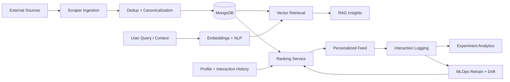

# VidyaVerse

> AI-powered opportunity intelligence platform that helps students discover, prioritize, and act on internships, research roles, scholarships, and hackathons.

**Last updated:** April 28, 2026  
**Status:** Active build, production-readiness gates enabled

## 1) Executive Summary
VidyaVerse is a full-stack AI/ML system, not just a listings app.
It combines ingestion, semantic retrieval, learned ranking, explainable AI responses, experimentation, and operational guardrails in one product loop.

**Core thesis:** Better opportunity outcomes require a system that continuously learns from user behavior, not static keyword filters.

## 2) Problem and Motivation
Students search fragmented portals with inconsistent quality, duplicate postings, and weak relevance ordering. The result is high effort and low conversion.

VidyaVerse addresses this with:
- retrieval quality (semantic + vector-based)
- ranking quality (behavior-informed learned ranker)
- explainability (RAG answer panel with grounded context)
- measurement (online/offline experiment and parity gates)

## 3) What Makes This Stand Out
Compared with standard portal architectures, this system adds:
- **Closed learning loop:** impressions -> clicks/saves/applies -> retrain -> gated promotion
- **Evidence-driven ranking:** `baseline | semantic | ml | ab` modes with measurable lift
- **Production security posture:** cookie sessions, CSRF, CSP/Trusted Types, abuse locks, audit logs
- **Operational maturity:** CI release gates, incident artifacts, scheduled scorecards, synthetic checks
- **Privileged governance:** hidden admin control plane with strict single-admin + TOTP

## 4) Architecture


## 5) Technology Stack
| Layer | Technologies |
|---|---|
| Frontend | Next.js 16, TypeScript, Playwright |
| Backend | FastAPI, Pydantic, Beanie ODM |
| Data | MongoDB, Redis |
| AI/ML | sentence-transformers, FAISS/NumPy retrieval, learned ranker |
| Observability/Ops | GitHub Actions, Prometheus metrics, Slack/PagerDuty hooks |
| Security | HttpOnly session cookies, CSRF middleware, CSP, Trusted Types, auth abuse controls |

## 6) Implemented Scope
### Product
- Guest-accessible dashboard preview for unauthenticated users.
- Personalized dashboard behavior for signed-in users.
- Candidate + employer user journeys.
- Ask AI opportunity assistant.

### AI/ML
- Multi-source ingestion with semantic deduplication.
- Vector retrieval + NLP intent/NER support.
- Ranking modes: `baseline`, `semantic`, `ml`, `ab`.
- Learned ranker retraining, drift checks, and activation policy.
- Offline benchmark and online parity/champion-challenger gates.

### Platform
- MongoDB-first backend architecture + Redis support.
- Background jobs with retry and dead-letter behavior.
- Staging integrated E2E framework and release-blocking checks.

### Security and Governance
- Cookie-first auth; localStorage token persistence removed.
- CSRF protection for unsafe requests under cookie auth.
- Security headers with strict CSP + Trusted Types controls.
- Auth lockout/audit instrumentation.
- Hidden admin control plane with TOTP and admin action auditing.

## 7) Metrics and Impact
<!-- DATASET_SNAPSHOT:START -->

## Dataset Size (Verified Snapshot)
Snapshot date: **May 06, 2026**

- Opportunities: **330**
- Applications: **0**
- Opportunity interactions: **15,706**
- Experiments: **3**
- Experiment assignments: **300**
- Ranking model versions: **83**
- Drift reports: **84**
- Profiles: **319**
- Users: **323**

Source distribution for opportunities:
- `freshersworld`: 61
- `internshala`: 58
- `indeed_india`: 53
- `unstop`: 32
- `linkedin`: 19
- `ivy_rss`: 15
- `hackerearth`: 12
- `ycombinator_jobs`: 12
- `aicte_internship`: 10
- `makeintern`: 9
- `wayup`: 9
- `devfolio`: 8
- `devpost`: 8
- `foundit`: 8
- `promilo`: 7
- `hack2skill`: 5
- `codeforces`: 2
- `handshake`: 1
- `techgig`: 1

<!-- DATASET_SNAPSHOT:END -->

### Offline retrieval quality
- Precision@5: **0.0667 -> 0.2000** (**+200%**)
- Recall@5: **0.3333 -> 1.0000** (**+200%**)
- nDCG@5: **0.3333 -> 1.0000** (**+200%**)
- MRR@5: **0.3333 -> 1.0000** (**+200%**)

### Real pilot lift (14-day window)
- CTR lift (`ml` vs baseline): **+58.21%**
- Apply-rate lift (`ml` vs baseline): **+153.11%**
- Save-rate lift (`ml` vs baseline): **+138.67%**

### Model lifecycle snapshot
<!-- MODEL_VERSION_METADATA:START -->

Updated: **2026-04-18T07:04:42.628589**

Policy: `guarded` (auto_activate=False, min_auc_gain=0.0, min_positive_rate=0.005, max_weight_shift=0.35)
Schedule: retrain every `24h`, drift check every `6h`, drift-triggered retrain=`True`
Alerts: enabled=`True`, cooldown=`120m`

Active model: `69e1c43e` (ranking-weights-v2) rows=11530 auc_gain=0.020068 activation_reason=`auto_activate_disabled`

Recent model versions:

| id | created_at | active | rows | auc_default | auc_learned | auc_gain | positive_rate | activation_reason |
|---|---|---:|---:|---:|---:|---:|---:|---|
| `69e32cf4` | 2026-04-18T07:04:20.592000 | no | 11530 | 0.547235 | 0.565407 | 0.018172 | 0.159237 | weight_shift_above_threshold:1.400000>0.350000 |
| `69e1c43e` | 2026-04-17T05:25:18.324000 | yes | 11530 | 0.547235 | 0.567303 | 0.020068 | 0.159237 | auto_activate_disabled |
| `69e1c37a` | 2026-04-17T05:22:02.094000 | no | 11530 | 0.530699 | 0.543927 | 0.013229 | 0.159237 | auto_activate_disabled |
| `69e1c362` | 2026-04-17T05:21:38.033000 | no | 11530 | 0.530699 | 0.543927 | 0.013229 | 0.159237 | auto_activate_disabled |
| `69e1c2d3` | 2026-04-17T05:19:15.238000 | no | 11530 | 0.530699 | 0.543927 | 0.013229 | 0.159237 | auto_activate_disabled |
| `69e12a18` | 2026-04-16T18:27:36.837000 | no | 11530 | 0.530699 | 0.543927 | 0.013229 | 0.159237 | auto_activate_disabled |
| `69e121b1` | 2026-04-16T17:51:45.261000 | no | 11530 | 0.530699 | 0.543927 | 0.013229 | 0.159237 | auto_activate_disabled |
| `69e1213f` | 2026-04-16T17:49:51.023000 | no | 11530 | 0.530699 | 0.543927 | 0.013229 | 0.159237 | auto_activate_disabled |
| `69e11e3d` | 2026-04-16T17:37:01.303000 | no | 11530 | 0.530699 | 0.543927 | 0.013229 | 0.159237 | auto_activate_disabled |
| `69e10cf1` | 2026-04-16T16:23:13.598000 | no | 4480 | 0.523782 | 0.513580 | -0.010202 | 0.143080 | n/a |
| `69e10c4a` | 2026-04-16T16:20:26.935000 | no | 4480 | 0.523782 | 0.513580 | n/a | 0.143080 | n/a |
| `69e10c0e` | 2026-04-16T16:19:26.647000 | no | 0 | 0.000000 | 0.000000 | n/a | 0.000000 | n/a |

Latest drift report: id=`69e32d07` alert=`False` psi=0.030294 max_z=0.069408 notified_at=n/a

<!-- MODEL_VERSION_METADATA:END -->

### Engineering quality signal
- Backend test suite: **77 passing tests** (latest local run)
- Frontend lint: **passing**
- Frontend production build: **passing**
- Security and release gates: **active in CI**

## 8) Reliability and Security Posture
- Session architecture favors HttpOnly cookie trust boundaries.
- CSRF origin/referer enforcement for unsafe methods.
- Strict CSP/Trusted Types controls integrated in security headers.
- Auth abuse lock policy with structured audit events.
- Production startup guardrails enforce secure host/CORS/CSP/cookie expectations.
- Privileged admin access segmented with dedicated auth path + TOTP + RBAC checks.

## 9) What Is In Progress
- Increase sustained real-user traffic volume for stronger statistical confidence.
- Complete full staging secret and ownership wiring across environments.
- Expand multi-role staging E2E matrix (success + failure + recovery paths).
- Promote strict production enforcement toggles once ops readiness is consistently stable.

## 10) Vision
Build VidyaVerse into a benchmark-grade Data Science + AI/ML + Full-Stack system where:
- ranking decisions are measurable and auditable,
- model promotion is policy-gated,
- product changes are experiment-driven,
- security and reliability remain first-class engineering constraints.

## 11) Quick Start
### Infrastructure
```bash
make up
```

### Backend
```bash
cd backend
python3 -m venv venv
source venv/bin/activate
pip install -r requirements.txt
uvicorn app.main:app --reload --host 0.0.0.0 --port 8000
```

### Frontend
```bash
cd frontend
npm install
npm run dev
```

## 12) Key Configuration Areas
- Auth/Security: `AUTH_SESSION_COOKIE_*`, `AUTH_COOKIE_ONLY_MODE`, `CSRF_*`, `SECURITY_CSP_*`
- Admin bootstrap: `ADMIN_BOOTSTRAP_ENABLED`, `ADMIN_BOOTSTRAP_EMAIL`, `ADMIN_BOOTSTRAP_PASSWORD`, `ADMIN_TOTP_SECRET`
- MLOps alerts/incidents: `MLOPS_ALERT_SLACK_WEBHOOK_URL`, `MLOPS_ALERT_PAGERDUTY_ROUTING_KEY`, `MLOPS_INCIDENT_DEFAULT_OWNER`
- Parity gates: `MLOPS_PARITY_*`

Reference templates:
- `backend/.env.example`
- `backend/.env.production.example`

## 13) High-Value Code Paths
- Backend core: `backend/app`
- Frontend core: `frontend/src`
- CI/CD workflows: `.github/workflows`
- Runbooks: `docs/runbooks`
- Hidden admin security architecture: `docs/runbooks/hidden-admin-security-architecture.md`

## 14) Recruiter / Reviewer Checklist
If you are evaluating engineering depth, inspect:
- CI gate design and release policy workflows
- ranking mode architecture and telemetry loop
- security middleware and auth audit model
- hidden admin RBAC/TOTP implementation
- benchmark artifacts and reproducibility scripts

## 15) README Maintenance Policy
This README is release facing documentation. It should be updated whenever there is a major change to:
- architecture
- ML/ranking behavior
- security model
- deployment/reliability controls
- measurable product outcomes
