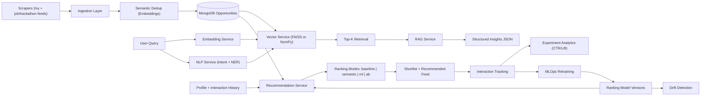

# VidyaVerse - AI Opportunity Intelligence Platform

## Problem
Students discover internships, research roles, scholarships, and hackathons across fragmented portals. Most systems rely on keyword filtering, weak personalization, and manual shortlisting, which leads to low relevance and poor application conversion.

## What Is Implemented (Current State)
### AI/ML and Data Components
- Modular embedding service with `sentence-transformers` primary path and OpenAI embedding fallback support.
- NLP service for:
  - intent classification (`internships`, `research`, `scholarships`, `hackathons`)
  - NER extraction (`deadlines`, `locations`, `companies`, `eligibility`)
- Vector retrieval service with FAISS acceleration when available and NumPy cosine fallback.
- Persistent vector index adapter (`mongo` provider) with in-memory fallback (`memory`) and text-hash invalidation.
- RAG service (`query -> retrieval -> structured insight generation`) exposed via `POST /api/v1/opportunities/ask-ai`.
- Recommendation stack with ranking modes: `baseline`, `semantic`, `ml`, `ab`.
- Interaction logging + experiment analytics endpoints (`CTR`, `lift`, experiment reports) with explicit `real` vs `simulated` traffic typing.
- Experiment-science diagnostics: SRM checks (chi-square allocation test) and per-variant power/MDE diagnostics.
- Evaluation endpoints for ranking quality (`Precision@K`, `Recall@K`, `nDCG@K`, `MRR`) and LLM response quality.
- Semantic deduplication during scraper upserts using embedding similarity thresholds.
- MLOps endpoints/services for retraining and drift checks.
- NLP model lifecycle endpoints for training, evaluation, model listing, and activation (`/api/v1/mlops/nlp/*`).

### Platform and Data Pipeline
- Multi-source ingestion: Ivy RSS + Indian opportunity sources.
- Resilient scraper runtime status + source-level run reports.
- Automatic updates via scheduler (default every 30 minutes).
- FastAPI backend + Next.js frontend with proxy routing.

## Production Engineering Credibility
### Background Jobs (Retries + Dead-Letter Queue)
- Scraper + MLOps scheduled work is enqueued into a Mongo-backed job queue with retries and DLQ (`background_jobs` collection).
- Admin endpoints:
  - `POST /api/v1/opportunities/trigger-scraper` (enqueues)
  - `GET /api/v1/jobs/recent`
  - `GET /api/v1/jobs/dead-letter`

### Caching (Query Embeddings + Top-K Results)
- Redis-backed caching for query embeddings and semantic retrieval results.
- Key toggles: `CACHE_EMBEDDINGS_ENABLED`, `CACHE_SEARCH_ENABLED`.

### Observability (p95 Latency, Error Rates, Scraper Success, Freshness SLA)
- Prometheus endpoint: `GET /metrics` (requires `metrics:read` scope by default).
- Key signals:
  - `http_request_duration_seconds` (use for p95)
  - `http_responses_total` (error rates)
  - `scraper_runs_total` + `scraper_source_runs_total` (scraper success)
  - `opportunity_freshness_seconds` + `opportunity_freshness_sla_breached` (freshness SLA)

### Security
- Auth scopes embedded in JWTs (admin tokens include `admin`, `metrics:read`, `jobs:*`, `scraper:trigger`).
- Redis-backed per-IP rate limits with stricter limits for `/api/v1/auth/*`.
- Production secret enforcement: refuses to boot in `ENVIRONMENT=production` if `SECRET_KEY` is left as the dev default.

## What Is Still Missing (High Impact Next)
- Production experiment traffic in live environments (real user behavior) to validate lift outside synthetic/bootstrap data.
- Real-time observability dashboard (p95 latency trend, scrape freshness SLA, experiment significance).
- Automated rollback playbook with pager/on-call escalation for sustained drift or conversion regressions.

## Architecture Diagram


## Dataset Size (Verified Snapshot)
Snapshot date: **April 16, 2026**

- Opportunities: **202**
- Applications: **16**
- Opportunity interactions: **15,961**
- Experiments: **2**
- Experiment assignments: **300**
- Ranking model versions: **3**
- Drift reports: **1**
- Profiles: **320**
- Users: **323**

Source distribution for opportunities:
- `freshersworld`: 60
- `internshala`: 58
- `indeed_india`: 32
- `unstop`: 30
- `ivy_rss`: 14
- `hack2skill`: 5

## Latency (Local API Benchmark)
Benchmark date: **April 16, 2026**
Server: FastAPI on `127.0.0.1:8000`, 50 requests per endpoint.

| Endpoint | p50 | p95 | avg | max |
|---|---:|---:|---:|---:|
| `GET /api/v1/opportunities/?limit=30` | 116.75 ms | 242.38 ms | 152.05 ms | 513.28 ms |
| `GET /api/v1/opportunities/scraper-status` | 0.81 ms | 1.26 ms | 1.01 ms | 7.36 ms |

## Metric Gains (Offline Retrieval Benchmark)
Benchmark artifact: `backend/benchmarks/results.json` (12 queries, K=5).

| Metric | Baseline | Semantic | Gain |
|---|---:|---:|---:|
| Precision@5 | 0.066667 | 0.200000 | +200.00% |
| Recall@5 | 0.333333 | 1.000000 | +200.00% |
| nDCG@5 | 0.333333 | 1.000000 | +200.00% |
| MRR@5 | 0.333333 | 1.000000 | +200.00% |

Interpretation:
- The benchmark fixture now contains hard negatives where lexical overlap ties are common.
- Semantic ranking is measurably separated, and CI enforces both metric-regression and latency budgets.

## Model Lifecycle Results
Auto-publish command:
```bash
python backend/scripts/publish_model_metadata.py
```

<!-- MODEL_VERSION_METADATA:START -->

Updated: **2026-04-16T00:00:00**

Policy: `guarded` (auto_activate=False, min_auc_gain=0.0, min_positive_rate=0.005, max_weight_shift=0.35)
Schedule: retrain every `24h`, drift check every `6h`, drift-triggered retrain=`True`
Alerts: enabled=`True`, cooldown=`120m`

Active model: `n/a`

Recent model versions:

| id | created_at | active | rows | auc_default | auc_learned | auc_gain | positive_rate | activation_reason |
|---|---|---:|---:|---:|---:|---:|---:|---|
| `n/a` | n/a | no | 0 | n/a | n/a | n/a | n/a | n/a |

Latest drift report: `n/a`

<!-- MODEL_VERSION_METADATA:END -->

## Simulated Traffic Benchmark (Persona-Based)
Transparency label: **Simulated traffic benchmark (persona-based)**  
Artifact: `backend/benchmarks/simulated/persona_traffic_report.json`

Run command (200-500 Indian personas):
```bash
cd backend
python3 scripts/simulate_persona_traffic.py \
  --personas 300 \
  --impressions-per-persona 24 \
  --lookback-days 14 \
  --seed 2026 \
  --email-prefix sim.india \
  --experiment-key ranking_mode_persona_sim \
  --real-pilot-experiment-key ranking_mode \
  --replace \
  --out ../backend/benchmarks/simulated/persona_traffic_report.json
```

Latest simulated run:
- Personas: **300**
- Generated interactions: **10,793**
- Funnel breakdown: `impression=7,050`, `view=2,018`, `click=1,195`, `save=366`, `apply=164`
- Variant mix: `baseline=5,181` events, `semantic=5,612` events

Simulated lift vs control (baseline -> semantic):
- Click-rate lift: **-6.13%** (`p=0.2306`)
- Apply-rate lift: **-31.27%** (`p=0.0155`)
- Save-rate lift: **-15.69%** (`p=0.0934`)

## Real Pilot Snapshot (Authentic Usage Data)
From live `ranking_mode` experiment (baseline vs ml), 14-day window:
- CTR lift (`ml` vs baseline): **+58.21%** (`p=4.4e-07`)
- Apply-rate lift (`ml` vs baseline): **+153.11%** (`p=0.0015`)
- Save-rate lift (`ml` vs baseline): **+138.67%** (`p=2e-08`)

## A/B Lift Endpoints
- `GET /api/v1/opportunities/experiments/ctr`
- `GET /api/v1/opportunities/experiments/lift`
- `GET /api/v1/experiments/{experiment_key}/report`
- `GET /api/v1/experiments/reports/side-by-side` (real vs simulated bundles)

## Same-Day Real Pilot (10-20 Testers)
1. Keep experiment `ranking_mode` active.
2. Share web app URL to 10-20 testers for a 2-3 hour session.
3. Ensure frontend logs impression/click/save/apply events to `POST /api/v1/opportunities/interactions`.
4. Pull experiment reports and publish both:
   - simulated benchmark (`ranking_mode_persona_sim`)
   - real pilot (`ranking_mode`)

## API Surface (Core AI/ML Endpoints)
- `GET /api/v1/opportunities/recommended/me?ranking_mode=baseline|semantic|ml|ab&query=...`
- `GET /api/v1/opportunities/shortlist/me?ranking_mode=baseline|semantic|ml|ab&query=...`
- `POST /api/v1/opportunities/ask-ai`
- `GET /api/v1/opportunities/ask-ai/schema`
- `POST /api/v1/opportunities/interactions`
- `POST /api/v1/opportunities/evaluate-ranking`
- `POST /api/v1/opportunities/evaluate-llm` (supports `include_judge=true` with `OPENROUTER_API_KEY`)
- `GET /api/v1/opportunities/experiments/ctr`
- `GET /api/v1/opportunities/experiments/lift`
- `POST /api/v1/mlops/retrain`
- `GET /api/v1/mlops/models`
- `POST /api/v1/mlops/nlp/train`
- `POST /api/v1/mlops/nlp/evaluate`
- `GET /api/v1/mlops/nlp/models`
- `POST /api/v1/mlops/nlp/models/{model_id}/activate`
- `GET /api/v1/mlops/drift`
- `GET /api/v1/mlops/lifecycle`

## Local Run
### Backend
```bash
cd backend
python3 -m venv venv
source venv/bin/activate
pip install -r requirements.txt
playwright install chromium
uvicorn app.main:app --reload --host 0.0.0.0 --port 8000
```

Production env templates:
```bash
backend/.env.example
backend/.env.production.example
```

OpenAI-compatible LLM routing (NVIDIA/OpenRouter/etc) is controlled by:
- `LLM_API_BASE_URL`
- `LLM_API_KEY`
- `LLM_MODEL`
- optional judge overrides: `LLM_JUDGE_API_BASE_URL`, `LLM_JUDGE_API_KEY`, `LLM_JUDGE_MODEL`

Embedding fallback routing:
- primary local model: `EMBEDDING_PROVIDER=sentence_transformers`
- fallback endpoint: `OPENAI_API_KEY` (+ optional `OPENAI_API_BASE_URL`)

RAG contract tests:
```bash
cd backend
venv/bin/python -m unittest discover -s tests -p 'test_*.py'
```

### Frontend
```bash
cd frontend
npm install
npm run dev
```

Frontend E2E interaction coverage (Playwright):
```bash
cd frontend
npx playwright install chromium
npm run e2e
```

### Bootstrap Ranking Data + Model Version (Staging/Prod Warmup)
```bash
cd backend
python scripts/bootstrap_ranking_pipeline.py --clear-existing --run-retrain --auto-activate
```

### Slim Domains (Preferred Workflow)
```bash
slim start web --port 3000
# https://web.test -> localhost:3000

slim start api --port 8000
# https://api.test -> localhost:8000

# Share a local preview publicly
slim share --port 3000 --subdomain demo --ttl 2h
```

## Resume-Grade Positioning
Built an AI-powered opportunity intelligence platform with modular NLP/ML services (embeddings, intent+NER, vector retrieval, RAG), ranking experimentation (`baseline/semantic/ml/ab`), interaction analytics, and MLOps retraining/drift pipelines on a FastAPI + Next.js architecture.
