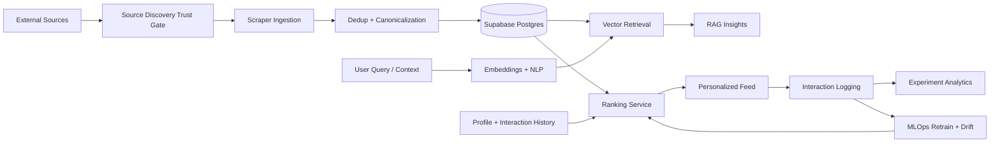
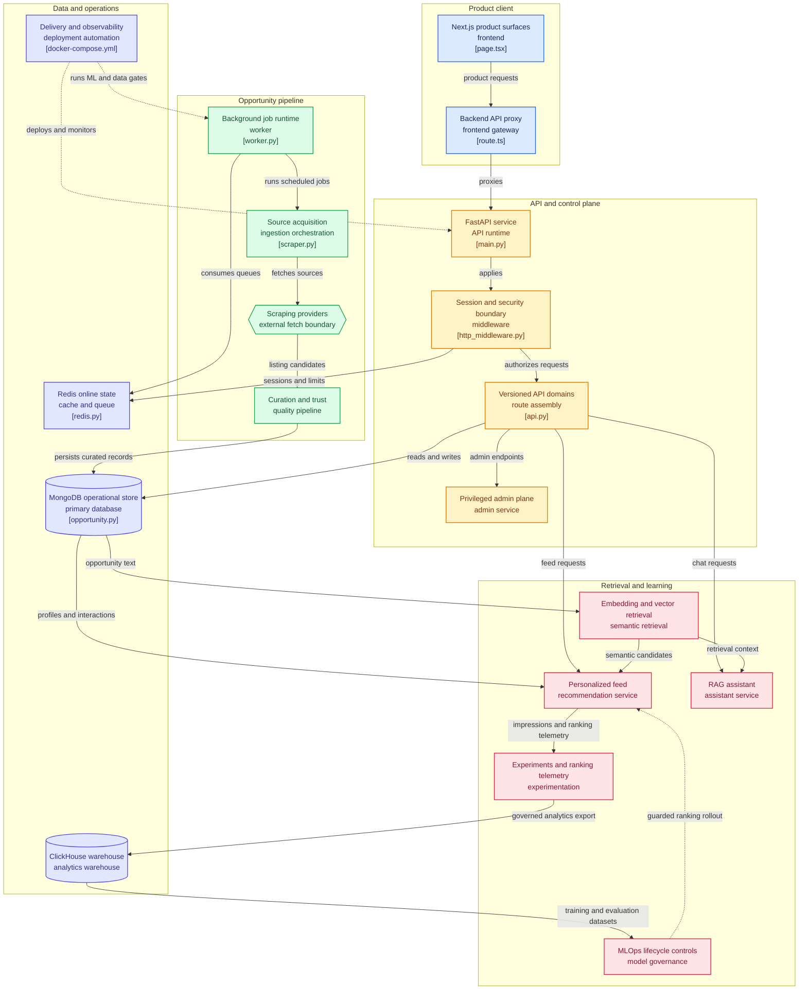

# VidyaVerse

> AI-powered opportunity intelligence platform that helps students discover, prioritize, and act on internships, jobs, hackathons, competitions, workshops, and conferences.

**Last updated:** August 10, 2026
**Status:** Active build, production-readiness gates enabled

## 1) Executive Summary
VidyaVerse is a full-stack AI/ML system, not just a listings app.
It combines ingestion, semantic retrieval, learned ranking, explainable AI responses, experimentation, and operational guardrails in one product loop.

**Core thesis:** Better opportunity outcomes require a system that continuously learns from user behavior, not static keyword filters.

## 2) Problem and Motivation
Students search fragmented portals with inconsistent quality, duplicate postings, and weak relevance ordering. The result is high effort and low conversion.

VidyaVerse addresses this with:
- retrieval quality (semantic + vector-based)
- ranking quality (behavior-informed learned ranker)
- explainability (RAG answer panel with grounded context)
- measurement (online/offline experiment and parity gates)

## 3) What Makes This Stand Out
Compared with standard portal architectures, this system adds:
- **Closed learning loop:** impressions -> clicks/saves/applies -> retrain -> gated promotion
- **Evidence-driven ranking:** `baseline | semantic | ml | ab` modes with per-request telemetry, shadow scoring and gated promotion (see the ranking-maturity note in section 7 for what is and is not validated today)
- **Self-growing source network:** discovered sources pass qualification, extraction, probation, trust scoring, and admin review before production promotion
- **Production security posture:** Redis-backed cookie sessions, CSRF double-submit, CSP/Trusted Types, abuse locks, audit logs
- **Operational maturity:** CI release gates, incident artifacts, scheduled scorecards, synthetic checks, and Grafana coverage for OTP delivery failures plus recommendation engagement
- **Independent deployment probes:** backend `/health` and frontend `/api/health` liveness endpoints are container healthchecks, while backend `/health/ready` verifies production dependencies behind authentication
- **Privileged governance:** hidden admin control plane with strict single-admin + TOTP

## 4) Architecture

```mermaid
flowchart LR
    A["External Sources"] --> A1["Source Discovery Trust Gate"]
    A1 --> B["Scraper Ingestion"]
    B --> C["Dedup + Canonicalization"]
    C --> D[("Supabase Postgres")]

    U["User Query / Context"] --> E["Embeddings + NLP"]
    D --> F["Vector Retrieval"]
    E --> F
    F --> G["RAG Insights"]

    D --> H["Ranking Service"]
    I["Profile + Interaction History"] --> H
    H --> J["Personalized Feed"]

    J --> K["Interaction Logging"]
    K --> L["Experiment Analytics"]
    K --> M["MLOps Retrain + Drift"]
    M --> H
```

```mermaid
flowchart TD

subgraph group_client["Product client"]
  node_web["Next.js product surfaces<br/>frontend<br/>[page.tsx]"]
  node_proxy["Backend API proxy<br/>frontend gateway<br/>[route.ts]"]
end

subgraph group_api["API and control plane"]
  node_fastapi["FastAPI service<br/>API runtime<br/>[main.py]"]
  node_api_domains["Versioned API domains<br/>route assembly<br/>[api.py]"]
  node_security["Session and security boundary<br/>middleware<br/>[http_middleware.py]"]
  node_admin["Privileged admin plane<br/>admin service"]
end

subgraph group_ingestion["Opportunity pipeline"]
  node_worker["Background job runtime<br/>worker<br/>[worker.py]"]
  node_acquisition["Source acquisition<br/>ingestion orchestration<br/>[scraper.py]"]
  node_providers{{"Scraping providers<br/>external fetch boundary"}}
  node_curation["Curation and trust<br/>quality pipeline"]
end

subgraph group_intelligence["Retrieval and learning"]
  node_recommendations["Personalized feed<br/>recommendation service"]
  node_vectors["Embedding and vector retrieval<br/>semantic retrieval"]
  node_assistant["RAG assistant<br/>assistant service"]
  node_experiments["Experiments and ranking telemetry<br/>experimentation"]
  node_mlops["MLOps lifecycle controls<br/>model governance"]
end

subgraph group_data["Data and operations"]
  node_mongo[("MongoDB operational store<br/>primary database<br/>[opportunity.py]")]
  node_redis["Redis online state<br/>cache and queue<br/>[redis.py]"]
  node_warehouse[("ClickHouse warehouse<br/>analytics warehouse")]
  node_delivery["Delivery and observability<br/>deployment automation<br/>[docker-compose.yml]"]
end

node_web -->|"product requests"| node_proxy
node_proxy -->|"proxies"| node_fastapi
node_fastapi -->|"applies"| node_security
node_security -->|"authorizes requests"| node_api_domains
node_api_domains -->|"admin endpoints"| node_admin
node_api_domains -->|"feed requests"| node_recommendations
node_api_domains -->|"chat requests"| node_assistant
node_api_domains -->|"reads and writes"| node_mongo
node_security -->|"sessions and limits"| node_redis
node_worker -->|"runs scheduled jobs"| node_acquisition
node_worker -->|"consumes queues"| node_redis
node_acquisition -->|"fetches sources"| node_providers
node_providers -->|"listing candidates"| node_curation
node_curation -->|"persists curated records"| node_mongo
node_mongo -->|"opportunity text"| node_vectors
node_vectors -->|"semantic candidates"| node_recommendations
node_mongo -->|"profiles and interactions"| node_recommendations
node_vectors -->|"retrieval context"| node_assistant
node_recommendations -->|"impressions and ranking telemetry"| node_experiments
node_experiments -->|"governed analytics export"| node_warehouse
node_warehouse -->|"training and evaluation datasets"| node_mlops
node_mlops -.->|"guarded ranking rollout"| node_recommendations
node_delivery -.->|"deploys and monitors"| node_fastapi
node_delivery -.->|"runs ML and data gates"| node_worker

click node_web "https://github.com/ankan00v/ivy-league-portal/blob/main/frontend/src/app/page.tsx"
click node_proxy "https://github.com/ankan00v/ivy-league-portal/blob/main/frontend/src/app/api/%5B...path%5D/route.ts"
click node_fastapi "https://github.com/ankan00v/ivy-league-portal/blob/main/backend/app/main.py"
click node_api_domains "https://github.com/ankan00v/ivy-league-portal/blob/main/backend/app/api/api_v1/api.py"
click node_security "https://github.com/ankan00v/ivy-league-portal/blob/main/backend/app/core/http_middleware.py"
click node_admin "https://github.com/ankan00v/ivy-league-portal/blob/main/backend/app/services/admin_identity_service.py"
click node_worker "https://github.com/ankan00v/ivy-league-portal/blob/main/backend/app/worker.py"
click node_acquisition "https://github.com/ankan00v/ivy-league-portal/blob/main/backend/app/services/scraper.py"
click node_providers "https://github.com/ankan00v/ivy-league-portal/blob/main/backend/app/services/firecrawl_client.py"
click node_curation "https://github.com/ankan00v/ivy-league-portal/blob/main/backend/app/services/duplicate_detector.py"
click node_recommendations "https://github.com/ankan00v/ivy-league-portal/blob/main/backend/app/services/recommendation_service.py"
click node_vectors "https://github.com/ankan00v/ivy-league-portal/blob/main/backend/app/services/embedding_pipeline.py"
click node_assistant "https://github.com/ankan00v/ivy-league-portal/blob/main/backend/app/services/assistant_service.py"
click node_experiments "https://github.com/ankan00v/ivy-league-portal/blob/main/backend/app/services/experiment_service.py"
click node_mlops "https://github.com/ankan00v/ivy-league-portal/blob/main/backend/app/services/mlops/retraining_service.py"
click node_mongo "https://github.com/ankan00v/ivy-league-portal/blob/main/backend/app/models/opportunity.py"
click node_redis "https://github.com/ankan00v/ivy-league-portal/blob/main/backend/app/core/redis.py"
click node_warehouse "https://github.com/ankan00v/ivy-league-portal/blob/main/backend/warehouse/clickhouse_schema.sql"
click node_delivery "https://github.com/ankan00v/ivy-league-portal/blob/main/docker-compose.yml"

classDef toneNeutral fill:#f8fafc,stroke:#334155,stroke-width:1.5px,color:#0f172a
classDef toneBlue fill:#dbeafe,stroke:#2563eb,stroke-width:1.5px,color:#172554
classDef toneAmber fill:#fef3c7,stroke:#d97706,stroke-width:1.5px,color:#78350f
classDef toneMint fill:#dcfce7,stroke:#16a34a,stroke-width:1.5px,color:#14532d
classDef toneRose fill:#ffe4e6,stroke:#e11d48,stroke-width:1.5px,color:#881337
classDef toneIndigo fill:#e0e7ff,stroke:#4f46e5,stroke-width:1.5px,color:#312e81
classDef toneTeal fill:#ccfbf1,stroke:#0f766e,stroke-width:1.5px,color:#134e4a
class node_web,node_proxy toneBlue
class node_fastapi,node_api_domains,node_security,node_admin toneAmber
class node_worker,node_acquisition,node_providers,node_curation toneMint
class node_recommendations,node_vectors,node_assistant,node_experiments,node_mlops toneRose
class node_mongo,node_redis,node_warehouse,node_delivery toneIndigo
```
## 5) Technology Stack
| Layer | Technologies |
|---|---|
| Frontend | Next.js 16, TypeScript, Playwright |
| Backend | FastAPI, Pydantic, Beanie ODM |
| Data | **Supabase Postgres (ap-south-1) is the database**, with pgvector for opportunity embeddings. Managed Redis for sessions, queues and rate limits. MongoDB is retired — see the migration note in section 6. ClickHouse integration exists but is **disabled**; see the warehouse note in section 7. |
| AI/ML | sentence-transformers, vector retrieval, learned ranker, optional skill-span extractor |
| Storage | S3-compatible production artifact store |
| Observability/Ops | GitHub Actions, Prometheus metrics, Grafana/BI, Slack/PagerDuty hooks |
| Security | HttpOnly session cookies, Redis-backed sessions, CSRF double-submit, CSP, Trusted Types, auth abuse controls |

## 6) Implemented Scope
### Product
- Guest-accessible dashboard preview for unauthenticated users.
- Personalized dashboard behavior for signed-in users.
- Candidate + employer user journeys.
- Ask AI opportunity assistant.
- Explainable recommendations on both opportunity feeds: users can see profile-aligned reasons, advisory eligibility context, and hide unsuitable listings while the feedback is recorded for future ranking improvements. Matching uses the candidate's degree, graduation year, skills, roles, locations, stipend expectation, and controlled availability preference.
- Candidate-only Resume Readiness Review: an on-demand, deterministic analysis of an uploaded resume with an explainable `0–100` clarity/readability score, category evidence, strengths, weak spots, and improvements. It is advisory only—not a hiring prediction, eligibility decision, or opportunity-ranking signal—and does not persist extracted resume text or review output.
- Published `/privacy` and `/terms` pages written from the implementation rather than a template, plus self-service account deletion from the profile page. Neither has been reviewed by a lawyer.
- Placement filter on the internships feed: `All | India | Remote | Hybrid | International`. The categories are **deliberately non-exclusive** — India/International is geography, Remote/Hybrid is work mode, so a remote internship in Bengaluru appears under both `India` and `Remote` and the pill counts sum to more than the corpus. Forcing one bucket per listing would hide remote Indian internships from the `India` pill. Membership is computed server-side by `app/services/opportunity_placement.py` and exposed as the `feed_categories` field on every opportunity response, so it is computed once server-side rather than duplicated in the frontend. Classification is inferential because the corpus cannot answer the question directly: measured on 2026-08-10, `work_mode` is null on 999 of 1,370 active rows (72%) and `location` on 515 (37%), so the signal is recovered from `work_mode`, then `location`, then title/description text, then India-only source boards. That places **1,073 of 1,370 active rows (78%)** in at least one pill — `india` 750, `remote` 299, `international` 293, `hybrid` 84. The remaining 22% carry no usable signal and appear only under `All`.

### AI/ML
- Multi-source ingestion with semantic deduplication.
- Vector retrieval + NLP intent/NER support.
- Ranking modes: `baseline`, `semantic`, `ml`, `ab`.
- Learned ranker retraining, drift checks, and activation policy.
- Offline benchmark and online parity/champion-challenger gates.

### Platform
- **Postgres-backed architecture + Redis support. The migration off MongoDB is complete.** `POSTGRES_ODM_ENABLED` patches every Beanie document model onto Postgres at startup, so the ~651 existing call sites keep their Beanie shape while the storage underneath changed; Mongo is never contacted. Verified 2026-08-11: Postgres held 1,845 opportunities, 30,143 interactions and every live user, with writes landing continuously, while the Atlas database had received no write since 2026-06-18. `MONGODB_URL` remains configured only so the abandoned data stays reachable, and nothing reads it.
- Background jobs with retry, dead-letter behavior, bounded concurrency, queue caps, and handler timeouts.
- Opportunity ingestion is scheduled immediately at API startup and then every `SCRAPER_INTERVAL_MINUTES` (30 minutes by default). Each `scraper.run` is persisted in the Postgres-backed job queue for retry and operational visibility; primary sources are saved before generic portals, each fetch batch has a bounded `SCRAPER_FETCH_BATCH_TIMEOUT_SECONDS` (180 seconds by default), and model-backed semantic dedup/embedding rebuilds remain off the ingestion critical path by default.
- Past-deadline opportunities are retired by setting `opportunity_status="expired"`, which hides them from every student-facing surface. Ingestion never hard-deletes opportunity rows: many connectors synthesise a deadline when the source exposes none, so deletion destroyed records that had not genuinely closed.
- Source discovery pipeline with company seeds, user submissions, qualification queues, adaptive extraction, JavaScript rendering for pages that mount their board client-side, probation, dynamic scraper registration, and health quarantine. Rendering is served by obscura ahead of crawlee; the paid providers (Firecrawl, Browser Use) remain wired but default to `disabled` via `FIRECRAWL_MODE` / `BROWSER_USE_MODE` after failing on every URL of the 2026-08-05 sweep.
- Opportunity quality scoring normalizes location, work mode, duration, stipend, and tags; it also evaluates deadline, eligibility, compensation, and duplicate signals. Low-completeness records enter the admin review queue with explicit reasons, while trust-risk records remain separately blocked from student-facing surfaces.
- Source-discovery skill tags use a guarded, optional skill-span extractor and retain the static keyword fallback whenever its local artifact is unavailable or inference fails.
- Official company careers intelligence with a curated S-tier internship watchlist across global tech, quant/trading, Indian product, IT services, government/PSU, research, consulting, analytics, banking, manufacturing, aerospace, energy, FMCG, and hidden-gem employers.
- The intelligent source-discovery loop continues expanding beyond the curated list through company seeds, careers-page crawling, web search, similar-source expansion, employer claims, and admin review.
- Autonomous discovery now generates data-informed web queries from profile interests and opportunity history, searches for third-party opportunity platforms, and stores auditable priority scores/reasons so qualification and extraction spend budget on the highest-value internship and 0-1 year sources first.
- Remote job ingestion is constrained to internships, entry-level, junior, fresher, new-grad, trainee, apprentice, no-experience, or explicit 0-1 year roles. Senior, lead, principal, staff, manager, director, architect, 2+ year, bootcamp, and paid-training posts are filtered out before persistence.
- Staging integrated E2E framework and release-blocking checks.

### Security and Governance
- Cookie-first auth with Redis-backed server-side session state in production.
- CSRF origin checks plus double-submit token validation for unsafe requests under cookie auth.
- Security headers with strict CSP + Trusted Types controls.
- Auth lockout/audit instrumentation.
- OTP delivery retries record redacted recipient identifiers and error classes only; plaintext email addresses, OTP values, and SMTP error bodies are excluded from application logs.
- Hidden admin control plane with TOTP and admin action auditing.

### Privacy
Added 2026-08-05. Before this the product had no deletion path, no published policy, and a consent checkbox that gated nothing.

- **Account erasure.** `DELETE /api/v1/users/me` behind a typed confirmation. `app/services/account_deletion_service.py` holds a classified inventory of every collection carrying a user identifier: identity and user-authored content are hard-deleted, while measurement rows (impressions, exposures, feature snapshots, experiment assignments) keep the row and swap the user id for a randomly generated pseudonym. Deleting measurements instead would retroactively change experiment denominators and training labels. `tests/test_account_deletion.py` sweeps `DOCUMENT_MODELS` and fails the build if a user-scoped collection is added without a disposition or a written exemption.
- **Consent that gates something.** `consent_data_processing` now controls inclusion in the analytics warehouse export, is stamped with a timestamp and `PRIVACY_POLICY_VERSION`, and supports withdrawal. Consent recorded against a superseded policy version does not count. Ranking a student's own feed is deliberately not gated on it.
- **Data minimization.** Gender, pronouns, date of birth, and address line1/landmark/pincode were removed from collection: nothing read them. `current_address_region` and `permanent_address_region` are retained because `feature_builder` uses them for location matching. `scripts/purge_minimized_profile_fields.py` (dry-run by default) unsets the retired keys from existing documents. Generated usernames no longer encode the student's birth year, which was previously visible on the public leaderboard.
- **Resume metadata redaction.** Uploads are rewritten before they touch disk to strip the PDF `/Info` dictionary and XMP packet, and DOCX core properties. Redaction fails open and logs, because blocking an upload is worse for the student than metadata we could not strip. Resume text continues to be parsed locally with spaCy and is never sent to a third-party LLM.
- **Telemetry retention and pseudonymized export.** Warehouse exports carry a keyed HMAC of the user id rather than the id itself. `TELEMETRY_RAW_RETENTION_DAYS` (default 400) bounds how long raw interaction rows keep their user link; `scripts/purge_aged_telemetry.py` (dry-run by default) rewrites aged rows rather than deleting them, so historical counts are unchanged.

## 7) Metrics and Impact

### Offline retrieval regression fixture
These come from `backend/benchmarks/`, which is a **CI regression fixture, not a
quality measurement**. Read them as "retrieval still behaves as expected on a
known input", nothing more.

- Precision@5: **0.0667 -> 0.2000**
- Recall@5: **0.3333 -> 1.0000**
- nDCG@5: **0.3333 -> 1.0000**
- MRR@5: **0.3333 -> 1.0000**

Why these numbers cannot be read as retrieval quality:
- The fixture is **12 synthetic queries** over 78 synthetic documents.
- Each query has exactly **one** relevant document, so Precision@5 = 0.2 is the
  arithmetic **ceiling**, not a result.
- Queries are constructed from their own answer, e.g.
  `"nlp nlp nlp nlp transformer tokenization ranking"` targets a document
  described as `"nlp nlp nlp nlp transformer tokenization retrieval ranking"`.
- The run uses the **hash embedding fallback**, not `sentence-transformers`.
- The `ml` mode is not evaluated at all; only `baseline` and `semantic` are.

`backend/benchmarks/results.production_temporal_holdout.json` is the more
honest artifact - paraphrased queries on a temporal holdout - and there
`semantic` scores **worse** than `baseline` (nDCG 0.938 vs 1.000).

### Online lift: not yet measurable
**There is no real-traffic lift measurement, and no A/B result.**

Every click, save and apply currently in the database was generated by
`backend/scripts/bootstrap_ranking_pipeline.py`, which draws outcomes from
hardcoded probabilities:

```python
ctr = 0.075 if variant == "baseline" else 0.118
save_rate = 0.028 if variant == "baseline" else 0.049
apply_given_click = 0.12 if variant == "baseline" else 0.16
```

Any "lift" computed over that data recovers those constants plus sampling
noise. It compares synthetic data against itself, so a significance test on it
is not meaningful.

Traffic to date, measured on 2026-08-10: **30,072 impressions,
3 clicks, 1 save, 7 applies** — and **every one of those rows belongs to a
single account**. That is one developer exercising the feed, not student
traffic, and the click-through rate it implies (0.01%) is a property of
scripted scrolling rather than of the ranker.

Note also that all 30,083 rows carry `traffic_type: "real"`. That label means
"never audited", not "verified genuine": the provenance backfill described
below has only ever been run against local Mongo, so on Atlas the default has
simply never been challenged. Running
`backend/scripts/backfill_traffic_provenance.py` there reports 0 rows to
relabel, because its heuristics target the bootstrap seeder's signature and
these rows did not come from it.

Interpret every ranking metric in this document as infrastructure validation,
not evidence of user outcomes. This section will carry meaningful numbers once
more than one person has used the product.

### Ranking maturity: what is and is not validated
Stated plainly, because the surrounding infrastructure is easy to mistake for a
working ranker:

- **`semantic` is the mode to trust.** Retrieval is genuinely semantic -
  `all-MiniLM-L6-v2`, 384-d, L2-normalised, cosine similarity, with the corpus
  indexed in `vector_index_entries`.
- **`ml` is not validated.** The current LightGBM artifact was trained on rows
  whose labels came from the seeding script above, so it learned from a random
  draw. On live candidates it emits an identical score for every row, which
  makes the final order fall through to the recency tiebreak.
- **`ab` currently resolves to `semantic`**, because the `ranking_mode`
  experiment is `paused`.
- **Known training defects** to fix before `ml` means anything: time-dependent
  features are computed at training time rather than impression time; the
  highest-gain feature is derived from the label; and the training call passes a
  subset of the features that serving populates.

The MLOps chassis around this - artifact checksum verification, shadow scoring,
staged rollout, champion/challenger gating, drift checks - is real and works.
It just has nothing meaningful to promote yet.

### Model lifecycle snapshot
<!-- MODEL_VERSION_METADATA:START -->

Updated: **2026-07-30T09:21:04.232416+00:00**

Policy: `guarded` (auto_activate=False, min_auc_gain=0.02, min_positive_rate=0.005, max_weight_shift=0.35)
Schedule: retrain every `24h`, drift check every `6h`, drift-triggered retrain=`True`
Alerts: enabled=`True`, cooldown=`120m`

Active model: `69f4be20` (ranking-weights-bootstrap-v1) rows=0 auc_gain=n/a activation_reason=`n/a`

Recent model versions:

| id | created_at | active | rows | auc_default | auc_learned | auc_gain | positive_rate | activation_reason |
|---|---|---:|---:|---:|---:|---:|---:|---|
| `69f4be20` | 2026-05-01T14:52:16.049000 | yes | 0 | 0.000000 | 0.000000 | n/a | 0.000000 | n/a |

Latest drift report: `n/a`

<!-- MODEL_VERSION_METADATA:END -->

### Skill-span extraction lifecycle
- `backend/scripts/train_skill_extractor_transformer.py` trains an optional token-classification model for extracting skill phrases from opportunity text. It is used only to enrich source-discovery query tags; it does **not** train or influence the behavioral opportunity ranker.
- The training source is [SkillSpan](https://huggingface.co/datasets/jjzha/skillspan), pinned to revision `33062e6bd0e03a5e01ae299ce0518f4613ef4298` and licensed CC-BY-4.0. Its split contains 4,800 train, 3,174 development, and 3,569 held-out test sentences.
- The base model is [JobBERT](https://huggingface.co/jjzha/jobbert-base-cased), BERT continued-pretrained on job postings by the author of SkillSpan. It is **cased** deliberately: most skills are proper nouns (Python, SQL, AWS, PyTorch), and the previous `distilbert-base-uncased` base discarded that signal before training.
- The current local run selected epoch 5 at a 0.30 confidence threshold on the development split and achieved held-out exact-span F1 `0.600594` (precision `0.574037`, recall `0.629729`) against the `0.50` promotion gate, up from `0.537738` on the uncased base. Selection is made on development data and the test split is scored once. The reproducible local report is `backend/benchmarks/skill_extractor_transformer_latest.json`.
- Confidence thresholds at or below `1/num_labels` are inert, because the argmax class of a three-way softmax always scores at least one third. Measured: `0.05` and `0.30` produce identical development F1. The default sweep therefore starts at `0.34`.
- Runtime loading is controlled by `SKILL_EXTRACTOR_ENABLED`, `SKILL_EXTRACTOR_MODEL_PATH`, and `SKILL_EXTRACTOR_MIN_CONFIDENCE`. Model directories are ignored; a missing, corrupt, or rejected artifact falls back to the existing deterministic tags instead of breaking discovery.
- The [India 2025 internship dataset](https://www.kaggle.com/datasets/jayaantanaath/internship-opportunities-in-india-2025/data) is suitable only as a deduplicated validation corpus for structured field extraction. It has no user-to-opportunity interaction labels, so it must never be used to train the learned ranker.

### Engineering quality signal
- Focused scraper/source contract suite: **70 passing tests, 73 subtests** across `test_scraper_fetch_providers`, `test_scraper_health_service`, `test_scraper_ingestion` and `test_source_discovery_pipeline` (local run on August 10, 2026)
- Production infra readiness gate: managed Postgres, Redis, and S3-compatible artifact storage are verified from the local runtime; ClickHouse is reported as skipped while disabled. The full strict gate still requires deployed frontend/backend domains and a production BI URL.
- Local developer harness smoke: 15/15 checks passed on July 29, 2026 - backend, database, Redis, queue, embedding model, learned ranker, artifact store, public opportunities, API docs, and all frontend routes. **Not re-run since**, and the stack has changed materially in that time (obscura in the fetch chain, Postgres migration scaffolding, readiness-probe changes). Treat it as a July 29 result, not current status. This is not production deployment proof.
- Analytics warehouse: the eight marts exist under `backend/storage/warehouse/marts/` and are served to the analytics API from DuckDB. They were **last materialized on July 29, 2026**, so `check_warehouse_release_gate` should not be assumed `fresh` today.
- **ClickHouse is disabled and unused.** Stated plainly because the stack table used to imply otherwise. It was only ever a write-only mirror: `warehouse_export_service` pushed eight mart tables to it and nothing read them back — the analytics API reads DuckDB (`read_mart`), and the only other clients were a health probe and a release gate. Its intended consumer, an external BI tool, does not exist (`ANALYTICS_BI_TOOL_URL` still points at `localhost:3001`). The managed instance was a 30-day trial that expired; its hostname has returned `NXDOMAIN` since roughly mid-July and the last successful export was **2026-06-19**, which nothing noticed. The volume never justified it either: all eight marts together are **441 KB**, where ClickHouse is built for billions of rows and DuckDB is the correct tool by orders of magnitude. The integration is retained behind `ANALYTICS_WAREHOUSE_CLICKHOUSE_ENABLED=False`, the export now isolates the mirror push so a dead endpoint cannot fail a successful mart build, and the readiness probe no longer gates on it.
- Backend full suite baseline: **583 passing tests, 114 subtests passed, 0 failing** (local run on August 10, 2026).
- Frontend lint: **passing**
- Frontend production build: **passing**
- Security and release gates: **active in CI**

## 8) Reliability and Security Posture
- Session architecture favors HttpOnly cookie trust boundaries.
- CSRF origin/referer enforcement plus double-submit token validation for unsafe methods.
- Strict CSP/Trusted Types controls integrated in security headers.
- Auth abuse lock policy with structured audit events.
- Production startup guardrails enforce secure host/CORS/CSP/cookie expectations.
- Privileged admin access segmented with dedicated auth path + TOTP + RBAC checks.

## 9) Current Production Readiness Boundary
- The codebase contains production gates, env contracts, CI workflows, security guardrails, managed-infra checks, and operational runbooks.
- Production runtime must use deployed services: managed Postgres (Supabase), managed Redis, S3-compatible artifact storage, live frontend/backend domains, configured OAuth/Turnstile/SMTP, production BI, and real alert destinations.
- Local Docker, localhost ports, MinIO, and local `.env` values are only a developer verification harness. They are not the production architecture and are rejected by the strict production infrastructure readiness gate.
- Without the real production secrets and deployed service endpoints, production can be validated only up to contract/readiness checks, not proven live.

## 10) What Is In Progress
- Increase sustained real-user traffic volume for stronger statistical confidence.
- Complete full staging secret and ownership wiring across environments.
- Expand multi-role staging E2E matrix (success + failure + recovery paths).
- Promote strict production enforcement toggles once ops readiness is consistently stable.

## 11) Vision
Build VidyaVerse into a benchmark-grade Data Science + AI/ML + Full-Stack system where:
- ranking decisions are measurable and auditable,
- model promotion is policy-gated,
- product changes are experiment-driven,
- security and reliability remain first-class engineering constraints.

## 12) Production Deployment Contract
Production deployment is environment-first. Configure secrets in the hosting platform or secret manager, not in committed files.

Required templates:
- `backend/.env.production.example`
- `frontend/.env.production.example`

Required production checks:
```bash
make validate-env
make release-contracts
make infra-check
make warehouse-refresh
make ds-gates
```

`make infra-check` is strict by default. It fails when Postgres, Redis, artifact storage, or BI point at localhost, Docker service names, MinIO, or other local/dev infrastructure.

Required external services:
- Supabase Postgres with TLS and production credentials. Note the pooler runs pgbouncer in transaction mode, so asyncpg clients must set `statement_cache_size=0`; the direct URL is required for migrations and `CREATE INDEX`, which a pooled session cannot hold advisory locks for.
- Redis or Upstash-compatible Redis for sessions, queues, rate limits, and online features.
- ClickHouse with TLS for analytics marts.
- S3-compatible artifact storage for model artifacts.
- Production domains for frontend and backend.
- Production BI URL for analytics inspection.
- SMTP, OAuth, Turnstile, and alerting secrets.

## 13) Developer Verification Harness
Use this only to reproduce checks before production deployment. It is not the production architecture.

```bash
make local-prod
python3 scripts/smoke_test_local.py \
  --backend-url http://127.0.0.1:8010 \
  --frontend-url http://127.0.0.1:3002 \
  --require-artifact-store \
  --require-warehouse-fresh
```

The local harness uses Docker dependencies and ignored `.env` placeholders only to prove code paths. Do not promote those values to production.

## 14) Key Configuration Areas
- Production endpoints: `MONGODB_URL`, `REDIS_URL`, `ANALYTICS_WAREHOUSE_CLICKHOUSE_*`, `MLOPS_MODEL_ARTIFACT_S3_*`, `MODEL_ARTIFACT_BUCKET`
- Auth/Security: `AUTH_SESSION_COOKIE_*`, `AUTH_COOKIE_ONLY_MODE`, `CSRF_*`, `SECURITY_CSP_*`
- Session store: `AUTH_SESSION_STORE_ENABLED`, `AUTH_SESSION_REQUIRE_SERVER_STATE`, `AUTH_SESSION_BIND_DEVICE`
- Job scaling: `JOBS_MAX_CONCURRENCY`, `JOBS_HANDLER_TIMEOUT_SECONDS`, `JOBS_MAX_PENDING_PER_TYPE`
- Admin bootstrap: `ADMIN_BOOTSTRAP_ENABLED`, `ADMIN_BOOTSTRAP_EMAIL`, `ADMIN_BOOTSTRAP_PASSWORD`, `ADMIN_TOTP_SECRET`
- MLOps alerts/incidents: `MLOPS_ALERT_SLACK_WEBHOOK_URL`, `MLOPS_ALERT_PAGERDUTY_ROUTING_KEY`, `MLOPS_INCIDENT_DEFAULT_OWNER`
- Parity gates: `MLOPS_PARITY_*`
- Privacy: `TELEMETRY_RAW_RETENTION_DAYS`, `ANALYTICS_WAREHOUSE_PSEUDONYMIZE_USERS`, `ANALYTICS_WAREHOUSE_REQUIRE_CONSENT`
- Source discovery: `DISCOVERY_ENABLED`, `SERPAPI_KEY`, `FIRECRAWL_ENABLED`, `FIRECRAWL_API_KEY`, `FIRECRAWL_MODE`, `FIRECRAWL_MAX_CONCURRENT`, `CLAUDE_API_KEY`, `MAX_LLM_EXTRACTIONS_PER_HOUR`, `MONTHLY_LLM_BUDGET_USD`, `QUALIFICATION_MIN_SCORE`, `TRUST_MIN_SCORE_AUTO_PROMOTE`, `PROBATION_*`, `SOURCE_FETCH_RATE_LIMIT`

## 15) High-Value Code Paths
- Backend core: `backend/app`
- Frontend core: `frontend/src`
- CI/CD workflows: `.github/workflows`
- Runbooks: `docs/runbooks`
- Hidden admin security architecture: `docs/runbooks/hidden-admin-security-architecture.md`
- Source discovery operations: `docs/runbooks/source-discovery-pipeline.md`
- Production data/ML operations: `docs/runbooks/data-platform-and-mlops.md`
- Source discovery: `backend/app/models/source_discovery.py`, `backend/app/services/source_discovery.py`, `backend/scripts/bootstrap_company_seeds.py`
- Data bootstrap: `backend/scripts/bootstrap_opportunities.py`, `backend/scripts/seed_test_data.py`, `backend/scripts/validate_data_health.py`, `backend/scripts/export_dataset_snapshot.py`

## 16) Production Bootstrap Commands
```bash
make bootstrap-opportunities
make validate-data-health
make dataset-snapshot
make release-contracts
```

`bootstrap-opportunities` runs scheduled scrapers, quality scoring, dedup reporting, and embedding rebuild. `seed-test-data` is intentionally excluded from the production bootstrap path; it is for local, CI, staging, or demo environments only.

## 17) Recruiter / Reviewer Checklist
If you are evaluating engineering depth, inspect:
- CI gate design and release policy workflows
- ranking mode architecture and telemetry loop
- security middleware and auth audit model
- hidden admin RBAC/TOTP implementation
- benchmark artifacts and reproducibility scripts

## 18) README Maintenance Policy
This README is release facing documentation. It should be updated whenever there is a major change to:
- architecture
- ML/ranking behavior
- security model
- deployment/reliability controls
- measurable product outcomes
