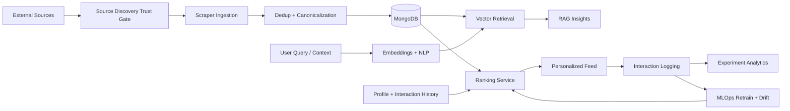

# VidyaVerse

> AI-powered opportunity intelligence platform that helps students discover, prioritize, and act on internships, research roles, scholarships, and hackathons.

**Last updated:** July 29, 2026
**Status:** Active build, production-readiness gates enabled

## 1) Executive Summary
VidyaVerse is a full-stack AI/ML system, not just a listings app.
It combines ingestion, semantic retrieval, learned ranking, explainable AI responses, experimentation, and operational guardrails in one product loop.

**Core thesis:** Better opportunity outcomes require a system that continuously learns from user behavior, not static keyword filters.

## 2) Problem and Motivation
Students search fragmented portals with inconsistent quality, duplicate postings, and weak relevance ordering. The result is high effort and low conversion.

VidyaVerse addresses this with:
- retrieval quality (semantic + vector-based)
- ranking quality (behavior-informed learned ranker)
- explainability (RAG answer panel with grounded context)
- measurement (online/offline experiment and parity gates)

## 3) What Makes This Stand Out
Compared with standard portal architectures, this system adds:
- **Closed learning loop:** impressions -> clicks/saves/applies -> retrain -> gated promotion
- **Evidence-driven ranking:** `baseline | semantic | ml | ab` modes with per-request telemetry, shadow scoring and gated promotion (see the ranking-maturity note in section 7 for what is and is not validated today)
- **Self-growing source network:** discovered sources pass qualification, extraction, probation, trust scoring, and admin review before production promotion
- **Production security posture:** Redis-backed cookie sessions, CSRF double-submit, CSP/Trusted Types, abuse locks, audit logs
- **Operational maturity:** CI release gates, incident artifacts, scheduled scorecards, synthetic checks
- **Privileged governance:** hidden admin control plane with strict single-admin + TOTP

## 4) Architecture

```mermaid
flowchart LR
    A["External Sources"] --> A1["Source Discovery Trust Gate"]
    A1 --> B["Scraper Ingestion"]
    B --> C["Dedup + Canonicalization"]
    C --> D[("MongoDB")]

    U["User Query / Context"] --> E["Embeddings + NLP"]
    D --> F["Vector Retrieval"]
    E --> F
    F --> G["RAG Insights"]

    D --> H["Ranking Service"]
    I["Profile + Interaction History"] --> H
    H --> J["Personalized Feed"]

    J --> K["Interaction Logging"]
    K --> L["Experiment Analytics"]
    K --> M["MLOps Retrain + Drift"]
    M --> H
```

## 5) Technology Stack
| Layer | Technologies |
|---|---|
| Frontend | Next.js 16, TypeScript, Playwright |
| Backend | FastAPI, Pydantic, Beanie ODM |
| Data | Managed MongoDB, managed Redis, managed ClickHouse |
| AI/ML | sentence-transformers, vector retrieval, learned ranker, optional skill-span extractor |
| Storage | S3-compatible production artifact store |
| Observability/Ops | GitHub Actions, Prometheus metrics, Grafana/BI, Slack/PagerDuty hooks |
| Security | HttpOnly session cookies, Redis-backed sessions, CSRF double-submit, CSP, Trusted Types, auth abuse controls |

## 6) Implemented Scope
### Product
- Guest-accessible dashboard preview for unauthenticated users.
- Personalized dashboard behavior for signed-in users.
- Candidate + employer user journeys.
- Ask AI opportunity assistant.

### AI/ML
- Multi-source ingestion with semantic deduplication.
- Vector retrieval + NLP intent/NER support.
- Ranking modes: `baseline`, `semantic`, `ml`, `ab`.
- Learned ranker retraining, drift checks, and activation policy.
- Offline benchmark and online parity/champion-challenger gates.

### Platform
- MongoDB-first backend architecture + Redis support.
- Background jobs with retry, dead-letter behavior, bounded concurrency, queue caps, and handler timeouts.
- Opportunity ingestion is scheduled immediately at API startup and then every `SCRAPER_INTERVAL_MINUTES` (30 minutes by default). Each `scraper.run` is persisted in the Mongo-backed job queue for retry and operational visibility; primary sources are saved before generic portals, each fetch batch has a bounded `SCRAPER_FETCH_BATCH_TIMEOUT_SECONDS` (180 seconds by default), and model-backed semantic dedup/embedding rebuilds remain off the ingestion critical path by default.
- Past-deadline opportunities are retired by setting `opportunity_status="expired"`, which hides them from every student-facing surface. Ingestion never hard-deletes opportunity rows: many connectors synthesise a deadline when the source exposes none, so deletion destroyed records that had not genuinely closed.
- Source discovery pipeline with company seeds, user submissions, qualification queues, adaptive extraction, managed Firecrawl fallback for JS-heavy pages, probation, dynamic scraper registration, and health quarantine.
- Source-discovery skill tags use a guarded, optional skill-span extractor and retain the static keyword fallback whenever its local artifact is unavailable or inference fails.
- Official company careers intelligence with a curated S-tier internship watchlist across global tech, quant/trading, Indian product, IT services, government/PSU, research, consulting, analytics, banking, manufacturing, aerospace, energy, FMCG, and hidden-gem employers.
- The intelligent source-discovery loop continues expanding beyond the curated list through company seeds, careers-page crawling, web search, similar-source expansion, employer claims, and admin review.
- Autonomous discovery now generates data-informed web queries from profile interests and opportunity history, searches for third-party opportunity platforms, and stores auditable priority scores/reasons so qualification and extraction spend budget on the highest-value internship and 0-1 year sources first.
- Remote job ingestion is constrained to internships, entry-level, junior, fresher, new-grad, trainee, apprentice, no-experience, or explicit 0-1 year roles. Senior, lead, principal, staff, manager, director, architect, 2+ year, bootcamp, and paid-training posts are filtered out before persistence.
- Staging integrated E2E framework and release-blocking checks.

### Security and Governance
- Cookie-first auth with Redis-backed server-side session state in production.
- CSRF origin checks plus double-submit token validation for unsafe requests under cookie auth.
- Security headers with strict CSP + Trusted Types controls.
- Auth lockout/audit instrumentation.
- Hidden admin control plane with TOTP and admin action auditing.

## 7) Metrics and Impact
<!-- DATASET_SNAPSHOT:START -->

## Dataset Size (Verified Snapshot)
Snapshot date: **July 29, 2026**

- Opportunities: **583**
- Applications: **0**
- Opportunity interactions: **9,776**
- Experiments: **2**
- Experiment assignments: **1**
- Ranking model versions: **1**
- Drift reports: **0**
- Profiles: **31**
- Users: **32**

Source distribution for opportunities:
- `company_careers_tcs_com`: 59
- `company_careers_datadoghq_com`: 46
- `internshala`: 28
- `linkedin`: 23
- `unstop`: 22
- `glassdoor`: 19
- `ivy_rss`: 17
- `company_careers_cloudflare_com`: 16
- `indeed_india`: 16
- `company_careers_paytm_com`: 14
- `github_internship_lists`: 13
- `hackerearth`: 12
- `makeintern`: 12
- `devfolio`: 11
- `aicte_internship`: 9
- `company_careers_iitd_ac_in`: 9
- `company_careers_iitr_ac_in`: 9
- `company_careers_upgrad_com`: 9
- `devpost`: 9
- `freshersworld`: 9
- `greenhouse`: 9
- `company_careers_iitb_ac_in`: 8
- `major_league_hacking`: 8
- `wayup`: 8
- `company_careers_airbnb_com`: 6
- `company_careers_hul_co_in`: 6
- `company_careers_razorpay_com`: 6
- `company_careers_iitk_ac_in`: 5
- `company_careers_notion_so`: 5
- `groww_in_company_careers`: 5
- `linkedin_remote`: 5
- `remoteok`: 5
- `techgig`: 5
- `company_careers_citi_com`: 4
- `company_careers_figma_com`: 4
- `company_careers_hsbc_com`: 4
- `company_careers_mckinsey_com`: 4
- `company_careers_oyorooms_com`: 4
- `hack2skill`: 4
- `naukri`: 4
- `promilo`: 4
- `company_careers_americanexpress_com`: 3
- `company_careers_bankofbaroda_in`: 3
- `company_careers_byjus_com`: 3
- `company_careers_gitlab_com`: 3
- `company_careers_hdfclife_com`: 3
- `company_careers_iisc_ac_in`: 3
- `company_careers_linkedin_com`: 3
- `company_careers_shopify_com`: 3
- `handshake`: 3
- `cloudflare_com_company_careers`: 2
- `company_careers_adobe_com`: 2
- `company_careers_axisbank_com`: 2
- `company_careers_bain_com`: 2
- `company_careers_drreddys_com`: 2
- `company_careers_goldmansachs_com`: 2
- `company_careers_groww_in`: 2
- `company_careers_icicibank_com`: 2
- `company_careers_infosys_com`: 2
- `company_careers_inmobi_com`: 2
- `company_careers_jpmorganchase_com`: 2
- `company_careers_kotak_com`: 2
- `company_careers_larsentoubro_com`: 2
- `company_careers_loreal_com`: 2
- `company_careers_meesho_io`: 2
- `company_careers_myvi_in`: 2
- `company_careers_niramai_com`: 2
- `company_careers_oracle_com`: 2
- `company_careers_remote_com`: 2
- `company_careers_zeta_tech`: 2
- `wellfound`: 2
- `company_careers_accenture_com`: 1
- `company_careers_acko_com`: 1
- `company_careers_apple_com`: 1
- `company_careers_atherenergy_com`: 1
- `company_careers_atlassian_com`: 1
- `company_careers_barc_gov_in`: 1
- `company_careers_bcg_com`: 1
- `company_careers_browserstack_com`: 1
- `company_careers_canva_com`: 1
- `company_careers_capgemini_com`: 1
- `company_careers_confluent_io`: 1
- `company_careers_databricks_com`: 1
- `company_careers_deloitte_com`: 1
- `company_careers_ey_com`: 1
- `company_careers_freshworks_com`: 1
- `company_careers_google_com`: 1
- `company_careers_hdfcbank_com`: 1
- `company_careers_ibm_com`: 1
- `company_careers_jsw_in`: 1
- `company_careers_mahindra_com`: 1
- `company_careers_makemytrip_com`: 1
- `company_careers_marutisuzuki_com`: 1
- `company_careers_mongodb_com`: 1
- `company_careers_morganstanley_com`: 1
- `company_careers_mphasis_com`: 1
- `company_careers_mu-sigma_com`: 1
- `company_careers_myntra_com`: 1
- `company_careers_phonepe_com`: 1
- `company_careers_policybazaar_com`: 1
- `company_careers_servicenow_com`: 1
- `company_careers_shiprocket_in`: 1
- `company_careers_visa_com`: 1
- `company_careers_wakefit_co`: 1
- `elastic_run_company_careers`: 1
- `paytm_com_company_careers`: 1
- `razorpay_com_company_careers`: 1
- `remotees`: 1
- `virtual_vocations`: 1
- `we_work_remotely`: 1

<!-- DATASET_SNAPSHOT:END -->

### Offline retrieval regression fixture
These come from `backend/benchmarks/`, which is a **CI regression fixture, not a
quality measurement**. Read them as "retrieval still behaves as expected on a
known input", nothing more.

- Precision@5: **0.0667 -> 0.2000**
- Recall@5: **0.3333 -> 1.0000**
- nDCG@5: **0.3333 -> 1.0000**
- MRR@5: **0.3333 -> 1.0000**

Why these numbers cannot be read as retrieval quality:
- The fixture is **12 synthetic queries** over 78 synthetic documents.
- Each query has exactly **one** relevant document, so Precision@5 = 0.2 is the
  arithmetic **ceiling**, not a result.
- Queries are constructed from their own answer, e.g.
  `"nlp nlp nlp nlp transformer tokenization ranking"` targets a document
  described as `"nlp nlp nlp nlp transformer tokenization retrieval ranking"`.
- The run uses the **hash embedding fallback**, not `sentence-transformers`.
- The `ml` mode is not evaluated at all; only `baseline` and `semantic` are.

`backend/benchmarks/results.production_temporal_holdout.json` is the more
honest artifact - paraphrased queries on a temporal holdout - and there
`semantic` scores **worse** than `baseline` (nDCG 0.938 vs 1.000).

### Online lift: not yet measurable
**There is no real-traffic lift measurement, and no A/B result.**

Every click, save and apply currently in the database was generated by
`backend/scripts/bootstrap_ranking_pipeline.py`, which draws outcomes from
hardcoded probabilities:

```python
ctr = 0.075 if variant == "baseline" else 0.118
save_rate = 0.028 if variant == "baseline" else 0.049
apply_given_click = 0.12 if variant == "baseline" else 0.16
```

Any "lift" computed over that data recovers those constants plus sampling
noise. It compares synthetic data against itself, so a significance test on it
is not meaningful.

Real (non-seed) traffic to date: **1,402 impressions, 0 clicks, 0 saves,
0 applies**, and the `applications` collection is empty. Interpret every
ranking metric in this document as infrastructure validation, not evidence of
user outcomes. This section will carry real numbers once real interactions
exist.

### Ranking maturity: what is and is not validated
Stated plainly, because the surrounding infrastructure is easy to mistake for a
working ranker:

- **`semantic` is the mode to trust.** Retrieval is genuinely semantic -
  `all-MiniLM-L6-v2`, 384-d, L2-normalised, cosine similarity, with the corpus
  indexed in `vector_index_entries`.
- **`ml` is not validated.** The current LightGBM artifact was trained on rows
  whose labels came from the seeding script above, so it learned from a random
  draw. On live candidates it emits an identical score for every row, which
  makes the final order fall through to the recency tiebreak.
- **`ab` currently resolves to `semantic`**, because the `ranking_mode`
  experiment is `paused`.
- **Known training defects** to fix before `ml` means anything: time-dependent
  features are computed at training time rather than impression time; the
  highest-gain feature is derived from the label; and the training call passes a
  subset of the features that serving populates.

The MLOps chassis around this - artifact checksum verification, shadow scoring,
staged rollout, champion/challenger gating, drift checks - is real and works.
It just has nothing meaningful to promote yet.

### Model lifecycle snapshot
<!-- MODEL_VERSION_METADATA:START -->

Updated: **2026-07-30T09:21:04.232416+00:00**

Policy: `guarded` (auto_activate=False, min_auc_gain=0.02, min_positive_rate=0.005, max_weight_shift=0.35)
Schedule: retrain every `24h`, drift check every `6h`, drift-triggered retrain=`True`
Alerts: enabled=`True`, cooldown=`120m`

Active model: `69f4be20` (ranking-weights-bootstrap-v1) rows=0 auc_gain=n/a activation_reason=`n/a`

Recent model versions:

| id | created_at | active | rows | auc_default | auc_learned | auc_gain | positive_rate | activation_reason |
|---|---|---:|---:|---:|---:|---:|---:|---|
| `69f4be20` | 2026-05-01T14:52:16.049000 | yes | 0 | 0.000000 | 0.000000 | n/a | 0.000000 | n/a |

Latest drift report: `n/a`

<!-- MODEL_VERSION_METADATA:END -->

### Skill-span extraction lifecycle
- `backend/scripts/train_skill_extractor_transformer.py` trains an optional token-classification model for extracting skill phrases from opportunity text. It is used only to enrich source-discovery query tags; it does **not** train or influence the behavioral opportunity ranker.
- The training source is [SkillSpan](https://huggingface.co/datasets/jjzha/skillspan), pinned to revision `33062e6bd0e03a5e01ae299ce0518f4613ef4298` and licensed CC-BY-4.0. Its split contains 4,800 train, 3,174 development, and 3,569 held-out test sentences.
- The current local run selected epoch 4 at a 0.50 confidence threshold and achieved held-out exact-span F1 `0.537738` against the `0.50` promotion gate. The reproducible local report is `backend/benchmarks/skill_extractor_transformer_latest.json`.
- Runtime loading is controlled by `SKILL_EXTRACTOR_ENABLED`, `SKILL_EXTRACTOR_MODEL_PATH`, and `SKILL_EXTRACTOR_MIN_CONFIDENCE`. Model directories are ignored; a missing, corrupt, or rejected artifact falls back to the existing deterministic tags instead of breaking discovery.
- The [India 2025 internship dataset](https://www.kaggle.com/datasets/jayaantanaath/internship-opportunities-in-india-2025/data) is suitable only as a deduplicated validation corpus for structured field extraction. It has no user-to-opportunity interaction labels, so it must never be used to train the learned ranker.

### Engineering quality signal
- Focused scraper/source contract suite: **53 passing tests** (latest local run on July 29, 2026)
- Production infra readiness gate: managed MongoDB, Redis, ClickHouse, and S3-compatible artifact storage have been verified from the local runtime; the full strict gate still requires deployed frontend/backend domains and a production BI URL.
- Local developer harness smoke: 15/15 checks passed on July 29, 2026 - backend, MongoDB, Redis, queue, embedding model, learned ranker, artifact store, public opportunities, API docs, and all frontend routes. This is not production deployment proof.
- Analytics warehouse: all eight ClickHouse marts materialize and `check_warehouse_release_gate` reports `status=fresh` (July 29, 2026).
- Backend full suite baseline: **269 passing tests** (latest recorded full run on July 29, 2026)
- Frontend lint: **passing**
- Frontend production build: **passing**
- Security and release gates: **active in CI**

## 8) Reliability and Security Posture
- Session architecture favors HttpOnly cookie trust boundaries.
- CSRF origin/referer enforcement plus double-submit token validation for unsafe methods.
- Strict CSP/Trusted Types controls integrated in security headers.
- Auth abuse lock policy with structured audit events.
- Production startup guardrails enforce secure host/CORS/CSP/cookie expectations.
- Privileged admin access segmented with dedicated auth path + TOTP + RBAC checks.

## 9) Current Production Readiness Boundary
- The codebase contains production gates, env contracts, CI workflows, security guardrails, managed-infra checks, and operational runbooks.
- Production runtime must use deployed services: managed MongoDB, managed Redis, managed ClickHouse, S3-compatible artifact storage, live frontend/backend domains, configured OAuth/Turnstile/SMTP, production BI, and real alert destinations.
- Local Docker, localhost ports, MinIO, and local `.env` values are only a developer verification harness. They are not the production architecture and are rejected by the strict production infrastructure readiness gate.
- Without the real production secrets and deployed service endpoints, production can be validated only up to contract/readiness checks, not proven live.

## 10) What Is In Progress
- Increase sustained real-user traffic volume for stronger statistical confidence.
- Complete full staging secret and ownership wiring across environments.
- Expand multi-role staging E2E matrix (success + failure + recovery paths).
- Promote strict production enforcement toggles once ops readiness is consistently stable.

## 11) Vision
Build VidyaVerse into a benchmark-grade Data Science + AI/ML + Full-Stack system where:
- ranking decisions are measurable and auditable,
- model promotion is policy-gated,
- product changes are experiment-driven,
- security and reliability remain first-class engineering constraints.

## 12) Production Deployment Contract
Production deployment is environment-first. Configure secrets in the hosting platform or secret manager, not in committed files.

Required templates:
- `backend/.env.production.example`
- `frontend/.env.production.example`

Required production checks:
```bash
make validate-env
make release-contracts
make infra-check
make warehouse-refresh
make ds-gates
```

`make infra-check` is strict by default. It fails when MongoDB, Redis, ClickHouse, artifact storage, or BI point at localhost, Docker service names, MinIO, or other local/dev infrastructure.

Required external services:
- MongoDB with TLS and production credentials.
- Redis or Upstash-compatible Redis for sessions, queues, rate limits, and online features.
- ClickHouse with TLS for analytics marts.
- S3-compatible artifact storage for model artifacts.
- Production domains for frontend and backend.
- Production BI URL for analytics inspection.
- SMTP, OAuth, Turnstile, and alerting secrets.

## 13) Developer Verification Harness
Use this only to reproduce checks before production deployment. It is not the production architecture.

```bash
make local-prod
python3 scripts/smoke_test_local.py \
  --backend-url http://127.0.0.1:8010 \
  --frontend-url http://127.0.0.1:3002 \
  --require-artifact-store \
  --require-warehouse-fresh
```

The local harness uses Docker dependencies and ignored `.env` placeholders only to prove code paths. Do not promote those values to production.

## 14) Key Configuration Areas
- Production endpoints: `MONGODB_URL`, `REDIS_URL`, `ANALYTICS_WAREHOUSE_CLICKHOUSE_*`, `MLOPS_MODEL_ARTIFACT_S3_*`, `MODEL_ARTIFACT_BUCKET`
- Auth/Security: `AUTH_SESSION_COOKIE_*`, `AUTH_COOKIE_ONLY_MODE`, `CSRF_*`, `SECURITY_CSP_*`
- Session store: `AUTH_SESSION_STORE_ENABLED`, `AUTH_SESSION_REQUIRE_SERVER_STATE`, `AUTH_SESSION_BIND_DEVICE`
- Job scaling: `JOBS_MAX_CONCURRENCY`, `JOBS_HANDLER_TIMEOUT_SECONDS`, `JOBS_MAX_PENDING_PER_TYPE`
- Admin bootstrap: `ADMIN_BOOTSTRAP_ENABLED`, `ADMIN_BOOTSTRAP_EMAIL`, `ADMIN_BOOTSTRAP_PASSWORD`, `ADMIN_TOTP_SECRET`
- MLOps alerts/incidents: `MLOPS_ALERT_SLACK_WEBHOOK_URL`, `MLOPS_ALERT_PAGERDUTY_ROUTING_KEY`, `MLOPS_INCIDENT_DEFAULT_OWNER`
- Parity gates: `MLOPS_PARITY_*`
- Source discovery: `DISCOVERY_ENABLED`, `SERPAPI_KEY`, `FIRECRAWL_ENABLED`, `FIRECRAWL_API_KEY`, `FIRECRAWL_MODE`, `FIRECRAWL_MAX_CONCURRENT`, `CLAUDE_API_KEY`, `MAX_LLM_EXTRACTIONS_PER_HOUR`, `MONTHLY_LLM_BUDGET_USD`, `QUALIFICATION_MIN_SCORE`, `TRUST_MIN_SCORE_AUTO_PROMOTE`, `PROBATION_*`, `SOURCE_FETCH_RATE_LIMIT`

## 15) High-Value Code Paths
- Backend core: `backend/app`
- Frontend core: `frontend/src`
- CI/CD workflows: `.github/workflows`
- Runbooks: `docs/runbooks`
- Hidden admin security architecture: `docs/runbooks/hidden-admin-security-architecture.md`
- Source discovery operations: `docs/runbooks/source-discovery-pipeline.md`
- Production data/ML operations: `docs/runbooks/data-platform-and-mlops.md`
- Source discovery: `backend/app/models/source_discovery.py`, `backend/app/services/source_discovery.py`, `backend/scripts/bootstrap_company_seeds.py`
- Data bootstrap: `backend/scripts/bootstrap_opportunities.py`, `backend/scripts/seed_test_data.py`, `backend/scripts/validate_data_health.py`, `backend/scripts/export_dataset_snapshot.py`

## 16) Production Bootstrap Commands
```bash
make bootstrap-opportunities
make validate-data-health
make dataset-snapshot
make release-contracts
```

`bootstrap-opportunities` runs scheduled scrapers, quality scoring, dedup reporting, and embedding rebuild. `seed-test-data` is intentionally excluded from the production bootstrap path; it is for local, CI, staging, or demo environments only.

## 17) Recruiter / Reviewer Checklist
If you are evaluating engineering depth, inspect:
- CI gate design and release policy workflows
- ranking mode architecture and telemetry loop
- security middleware and auth audit model
- hidden admin RBAC/TOTP implementation
- benchmark artifacts and reproducibility scripts

## 18) README Maintenance Policy
This README is release facing documentation. It should be updated whenever there is a major change to:
- architecture
- ML/ranking behavior
- security model
- deployment/reliability controls
- measurable product outcomes
