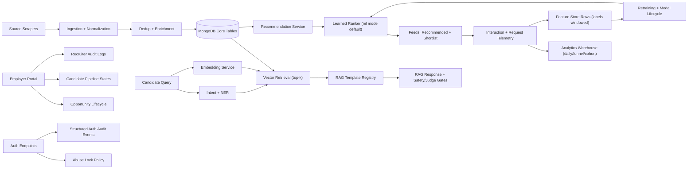

# Architecture (Publish Bundle)

## Notes

- Production inference defaults to `ml` ranking mode with automatic request-level fallback only when the learned ranker fails.
- Ask-AI RAG output is governed by versioned templates (`prompt + retrieval settings + judge rubric`) with offline and online threshold gates.
- Warehouse and feature-store tables are materialized from raw interaction + request telemetry for reproducible DS analysis.
